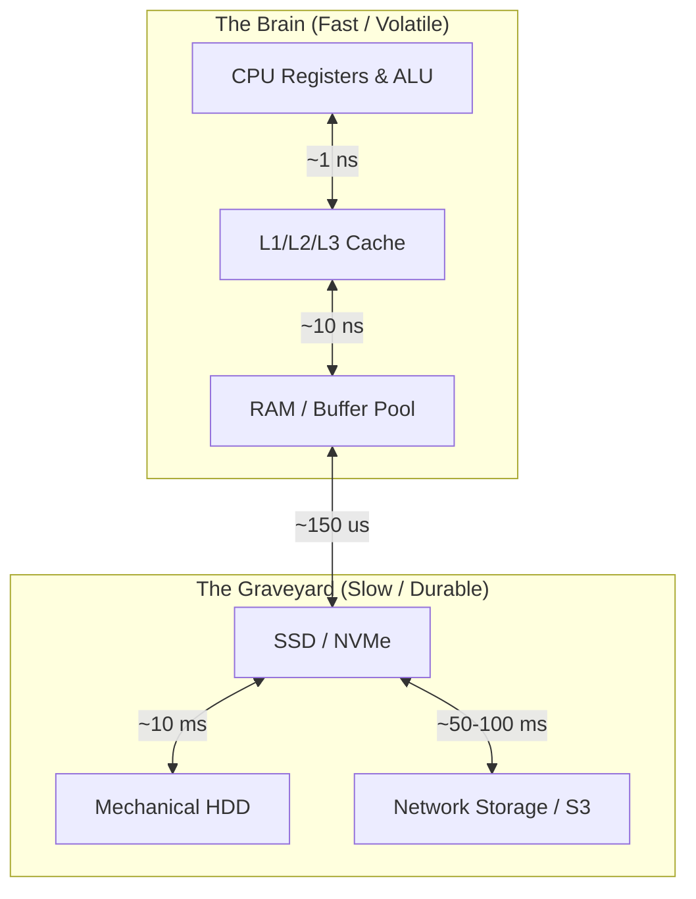
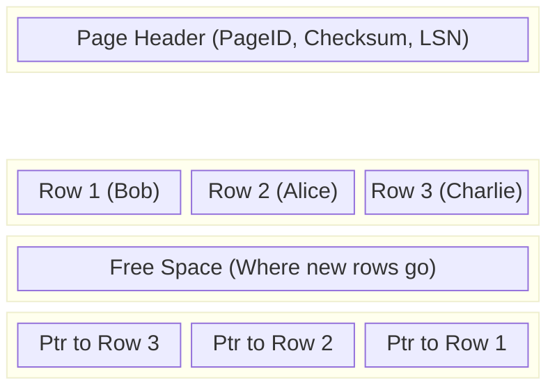
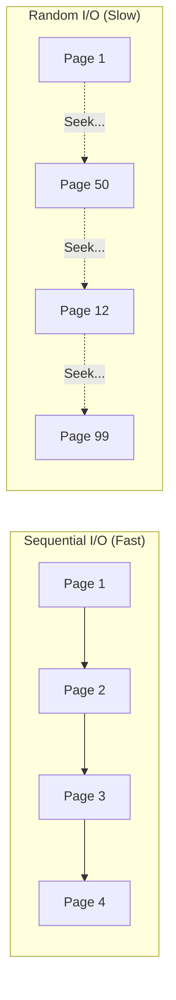

Welcome to the engine room. You've likely spent your career, thus far, writing SQL that feels abstract—declarative statements floating in the ether, returning rows as if summoned by a wizard. But here's the cold, hard truth: **There is no cloud**. It's just someone else's computer, and that computer is made of metal, silicon, and spinning magnets.

Your database is not a mathematical abstraction; it is a physical machine governed by the laws of physics. It has friction. It generates heat. And most importantly, it has a speed limit.

To understand performance, you have to stop thinking like a logician and start thinking like a mechanic. When you ask, "Why is this query slow?", what you are really asking is, "Which physical component is hitting its redline?"

Usually, it's the storage.

## 1.1 The Hierarchy of Speed: CPU vs. RAM vs. Disk
The fundamental struggle of every database engine—from SQLite on your phone to Snowflake running on thousands of nodes—is the massive chasm between how fast the brain thinks (CPU) and how fast it can grab a memory (Disk).

We call this the **Von Neumann Bottleneck**, but I prefer to call it the "Light vs. Snail" problem.

### The Latency Cliff
Let's look at the raw numbers. In modern computing, we assume time in nanoseconds. But we are terrible at visualizing nanoseconds. So, let's scale the timeframe up to more human terms.

Imagine **1 CPU Cycle** takes **1 second**.

| Component | Actual Latency (approx) | Human Scale Equivalent | The Reality |
|:---|:---|:---|:---|
| CPU L1 Cache | 0.5 ns | 1 second | Picking up a pen from your desk. |
| L2 Cache | 7 ns | 14 seconds | Searching a messy drawer for the pen. |
| RAM (Main Memory) | 100 ns | 3.5 minutes | Walking to the office fridge to get a soda. |
| SSD (Solid State) | 150,000 ns | 3.5 days | Waiting for an Amazon package. |
| HDD (Spinning Disk) | 10,000,000 ns | 4 months | Mailing a letter to the moon and waiting for a reply |

!!! note "The Mechanic's Rule #1"

    **Disk I/O is the most expensive operation you can perform.**
    
    If your query has to read from the disk (HDD or SSD), the CPU is essentially sitting idle for *months* (in CPU time) waiting for the data to arrive. This is why we care so much about indexes and caching. We aren't just trying to be tidy; we are desperately trying to avoid the 4-month wait.

### Why is Disk so slow? (The Physics)
Why the massive discrepancy? It comes down to moving parts vs. electrons.

1. **CPU & RAM**: These are purely electronic. Signals travel at a significant fraction of the speed of light. The limitations here are mostly about thermal throttling and the physical distance electricity has to travel across the motherboard.
2. **Spinning Disks (HDD)**: This is mechanical. A physical platter spins at 7,200 or 15,000 RPM. A mechanical arm (the actuator) must physically move to the correct track (Seek Time) and then wait for the platter to rotate the correct sector under the head (Rotational Latency). In the world of nanoseconds, moving a mechanical arm is glacial.
3. **The Network (The "Cloud" Disk)**: In modern architectures like BigQuery or Snowflake, your storage isn't even attached to the compute node. It's across the network (e.g., AWS S3). Now you introduce **network latency**—the speed of light through fiber optic cables, plus the time spent hopping through routers and switches.

### The "Page" Concept
Because the disk is slow, database engines never ask for just a single row. The cost of the "seek" (moving the arm) is so high taht once we are there, we might as well grab a whole chunk of data.

This chunk i called a **Page** (or **Block**).

- **Postgres**: 8 KB pages.
- **MySQL (InnoDB)**: 16 KB pages.
- **SQL Server**: 8 KB pages.

When you ask for `SELECT * FROM Users WHERE id = 1`, the database doesn't just read the few bytes for "Bob." it reads the entire 8 KB page that contains Bob, plus perhaps 50 other users who happened to be sitting next to him on the disk.

This leads to the most critical metric in query tuning: **page reads**.

!!! example "Visualizing the Fetch"

    Imagine you want a specific screw (a row).

    - **RAM** is a tool belt. You reach down, it's there.
    - **Disk** is a warehouse across town.
    - **Page I/O** means you can't just buy *one* screw. You have to buy a standard 8 KB box of mixed screws.

    If you need 10 screws, and they are all in the same box (Clustered), you make **one trip** to the warehouse.

    If you need 10 screws, and they are scattered across 10 different boxes (Fragmented/Random I/O), you make **10 trips** to the warehouse. That is the difference between a query taking 100 ns and 10 seconds.

### The Visual Hierarchy
Let's visualize the data access path using a Mermaid diagram. This is the path your data travels to get processed.

### Summary
Understanding this hierarchy is the prerequisite for everything else in this course. When we talk about "Index Scans" later, we are talking about minimizing trips to the warehouse. When we talk about "Columnar Storage," we are talking about packing the boxes (Pages) more efficiently so we can carry less junk.

The database engine is an elaborate caching machine designed to hide the fact that the disk is the enemy.

## 1.2 Pages and Extents: The Shipping Containers of Data
In the last section, we established that the disk is slow To mitigate this, databases never read a single row at a time. They read chunks.

In database terminology, this chunk is called a **page** (in PostgreSQL, and SQL Server) or a **block** (in Oracle). For the sake of consistency, we will use the term **page**.

If the database is a warehouse, the **page** is the standard cardboard box. You cannot move individual items; you can only move boxes.

### The Anatomy of a Page
Most relational databases use a fixed page size, typically **8 KB** or **16 KB**.

Why fixed? Because the operating system (OS) also manages storage in blocks (usually 4 KB). By aligning databases pages with OS blocks, we ensure that when the database asks for "page 101," the OS can hand it over cleanly without doing weird math or partial reads.

But a page isn't just a bucket of raw data. It has a specific, clever internal architecture known as the **slotted page structure**. This is designed to handle rows of varying lengths (e.g., a `VARCHAR(50)` that only contains "Bob").

Here is the blueprint of a standard page:

1. **Page Header**: Contains metadata (Page ID, Log Sequence Number for recovery, checksums).
2. **Row Data**: The actual data, growing from the top down.
3. **Free Space**: The empty void in the middle.
4. **Slot Array (Row Pointers)**: A list of pointers growing from the bottom up.

!!! question "Why the Gap in the Middle?"

    Notice how the **rows** grow down, but the **slot array** grows up? This is intentional.

    If we packed them all together at the top, every time you updated a row and it got slightly bigger (e.g., changing "Bob" to "Robert"), you’d have to shuffle every other row in the page to make room.

    By keeping free space in the center, the database engine can shuffle data and pointers independently without rewriting the whole structure constantly. It’s the "wiggle room" inside the box.

### Addressing a Row: The TID
When an index points to a row, it doesn't point to a memory address (which changes). It points to a **Tuple Identifier (TID)** or **Row ID (RID)**.

A TID usually looks like this: `(PageID, SlotIndex)`.

- **PageID**: Tells the engine which 8 KB block to load from disk.
- **SlotIndex**: Tells the engine which slot in the footer to look at. The slot contains the exact byte offset where the rows starts inside that page.

This level of indirection is crucial. If we defragment the pages and move "Bob" to a different spot *inside* the same page, we only update the Slot Array. The Index doesn't need to know.

### Extents: The Pallet
If a **page** is a box, an **extent** is a shipping pallet.

Allocating space one 8 KB page at a time is tedious for the file system. It causes **external fragmentation** (pages scattered all over the hard drive). To fix this, databases allocate **extents**.

- **SQL Server/Postgres** typically group 8 pages into an extent (64 KMB).
- **Concept**: When a table grows, the engine grabs a whole new extent.

This matters because of **Sequential I/O**.

## 1.3 Random vs. Sequential I/O: The Physics of Movement
To a data engineer, "I/O" (Input/Output) often feels like a single metric. But physically, there are two completely different types of I/O, and one is orders of magnitude faster than the other.

### The Turntable Analogy (HDD Physics)
To understand why this distinction exists, you have to look at a spinning hard drive (HDD). Even if you run on SSDs (which we will cover shortly), the database algorithm were designed with spinning disks in mind, and the principles of "locality" still apply.

Think of an HDD like a vinyl record player or a turntable.

1. **The Platter**: The disk spinning at high speed (e.g., 15,000 RPM).
2. **The Arm**: The mechanical arm that moves back and forth.
3. **The Head**: The reader at the tip of the arm.

Every time you read data, you pay a "tax" based on physics. The formula for Disk Access Time is:

$$
\text{Access Time } = \text{ Seek Time } + \text{ Rotational Latency } + \text{ Transfer Time}
$$

- **Seek Time (The Killer)**: The time it takes for the mechanical arm to physically move to the correct ring (track). This is slow.
- **Rotational Latency**: The time it takes for the spinning disk to bring the correct sector under the head.
- **Transfer Time**: The time it takes to actually read the magnetic bits as they fly by. This is fast.

### Sequential I/O: The "Gliding" Read
**Sequential I/O** occurs when we read data that is physically adjacent on disk.

- **The Physics**: The arm moves once to the start of the data. Then, it stays perfectly still. The disk spins, and the data flows under the head like a river.
- **The Cost**: You pay the Seek Time tax only once. After that, you are limited only by how fast the disk spins.
- **Throughput**: High (e.g., 100-200 MB/s on HDD).

**Example**: A **Full Table Scan**. The Database says, "Read everything from Page 1 to Page 10,000."

### Random I/O: The "Jumping" Read
**Random I/O** occurs when we read data scattered across different locations.

- **The Physics**: The arm moves to location A. Reads. Stops. Moves to location B. Reads. Stops. Moves to location C…
- **The Cost**: You pay the Seek Time tax *every single time*. The drive spends 90% of its time moving the arm and only 10% of its time actually reading data.
- **Throughput**: Low (e.g., 2-10 MB/s on HDD).

**Example**: An **Index Lookup** for 500 different IDs that are scattered randomly across the table.

### The "Tipping Point"
The physics lesson explains one of the most confusing behaviors of the Query Optimizer.

**The Scenario**: You have an index on `order_date`. You run a query asking for **all** orders in the last year (which is 20% of your table).

**The Question**: Why did the database ignore my index and do a Full Table Scan instead?

**The Answer**: Because reading 20% of the table via Random I/O (jumping around using the index) is actually *slower* than reading 100% of the table via Sequential I/O.

The Optimizer calculates the cost. It knows that jumping the mechanical arm 1,000,000 times will take 5 minutes, but reading the whole table sequentially will only take 1 minute. It chooses the path of least physical resistance.

!!! info "But what about SSDs?"

    You might say, "I use the cloud. I use SSDs. There are no moving parts!"

    While SSDs have no seek time (latency is uniform). **Sequential I/O is still faster than Random I/O on SSDs**, often by a factor of 3x to 5x.

    **Why?**

    1.  **Read Ahead (Prefetching):** Storage controllers are smart. If they see you reading Page 1, then Page 2, they will speculatively load Pages 3 and 4 into the buffer before you even ask for them. Random I/O breaks this prediction mechanism.
    2.  **Internal Parallelism:** SSDs organize memory into "channels." Sequential data can be striped across multiple channels, allowing the drive to read from multiple chips simultaneously.

## Quiz

<quiz>
In the "Light vs. Snail" analogy for database latency, if a CPU cycle takes 1 second, approximately how long does a random read from a standard spinning Hard Disk Drive (HDD) take?
- [ ] 3.5 minutes
- [ ] 14 seconds
- [ ] 3.5 days
- [x] 4 months

</quiz>

<quiz>
What is the fundamental unit of I/O in most relational databases (like PostgreSQL or SQL Server) when reading data from the disk?
- [x] A page (or block)
- [ ] A sector
- [ ] A column
- [ ] A single row

</quiz>

<quiz>
In the Slotted Page Structure, why does the 'Slot Array' (row pointers) grow from the bottom of the page upwards while the 'Row Data' grows from the top down?
- [ ] To ensure the page header is always at the center of the block.
- [x] To allow rows and pointers to be resized independently without rewriting the entire page.
- [ ] To optimize the checksum calculation for the page.
- [ ] To prevent fragmentation within the page.

</quiz>

<quiz>
Which of the following best describes the physical action that causes the high latency of Random I/O on a mechanical Hard Disk Drive?
- [x] Seek time
- [ ] Signal propagation
- [ ] Transfer time
- [ ] Rotational latency

</quiz>

<quiz>
Why is Sequential I/O significantly faster than Random I/O, even on modern Solid State Drives (SSDs) that lack moving parts?
- [ ] SSDs overheat when performing Random I/O, triggering thermal throttling.
- [ ] SSDs use Seek Time simulation to maintain compatibility with older drivers.
- [ ] Random I/O requires a checksum verification for every byte, whereas Sequential does not.
- [x] Sequential I/O allows for Prefetching (Read Ahead) and internal parallelism.

</quiz>

<quiz>
What is an 'Extent' in the context of database storage allocation?
- [ ] A backup copy of a page stored in RAM.
- [ ] A single 8 KB block of data.
- [ ] The maximum size a table can grow to.
- [x] A collection of contiguous Pages (e.g., 64 KB) allocated together.

</quiz>

<quiz>
A query optimizer chooses a 'Full Table Scan' (Sequential I/O) over an 'Index Scan' (Random I/O) to find 20% of the rows in a table. Why?
- [ ] Sequential I/O uses the CPU cache, while Random I/O does not.
- [ ] Full Table Scans are the default for any query returning more than 10 rows.
- [x] The overhead of random 'hops' for 20% of the data exceeds the cost of just reading the whole table linearly.
- [ ] The index was likely corrupted or missing.

</quiz>

<quiz>
What is 'Fragmentation' in the context of database storage?
- [ ] When the database splits a large table into multiple smaller tables.
- [x] When logically sequential data is stored in physically non-sequential pages.
- [ ] When a single row is split across multiple pages.
- [ ] When the hard drive platter becomes physically cracked.

</quiz>

<quiz>
When does a Tuple Identifier (TID) or Row ID typically consist of?
- [x] A Page ID and a Slot Index.
- [ ] The Primary Key value of the row.
- [ ] The memory address of the row in RAM.
- [ ] The creation timestamp and the user ID.

</quiz>

<quiz>
According to the 'Anatomy of a Page' (Section 1.2), what critical piece of metadata is stored in the Page Header to assist with database recovery?
- [ ] The Column Definitions (Schema).
- [ ] The Table Name.
- [ ] The User's Password Hash.
- [x] The Log Sequence Number (LSN).

</quiz>

<!-- mkdocs-quiz results -->

## Lab
Please complete module 1's lab in the companion GitHub repository.