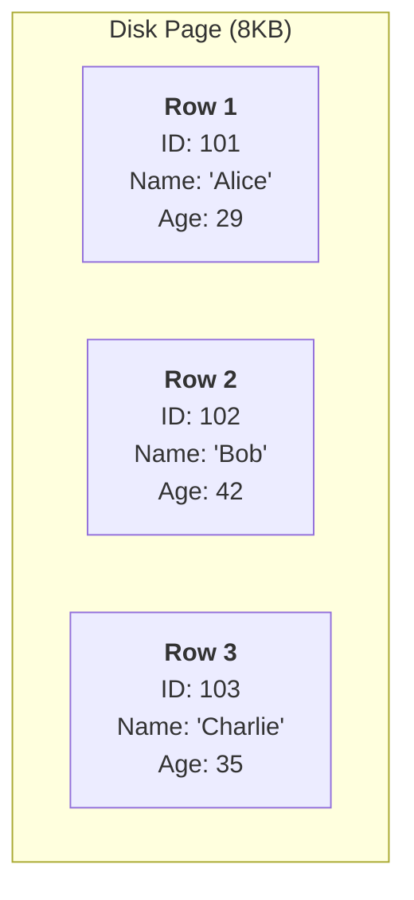
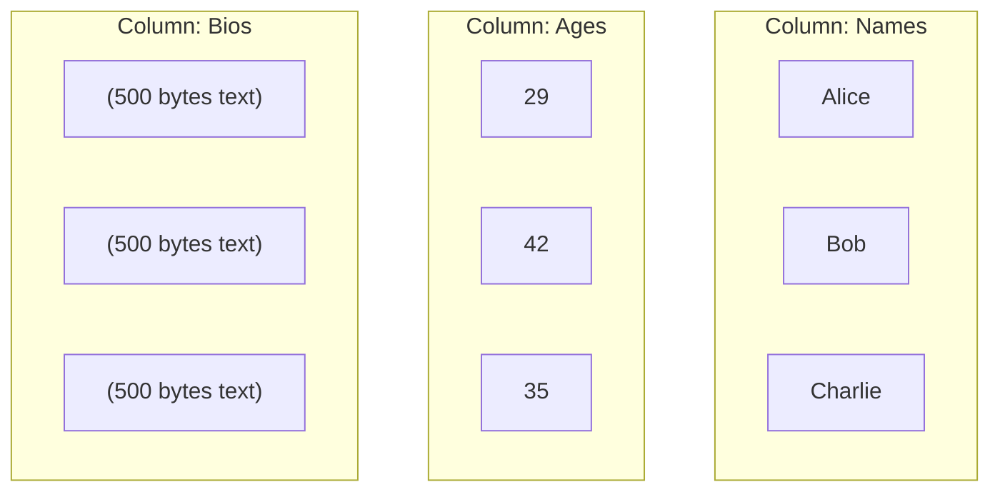

In the previous module, we learned that the disk is the enemy. Every time we ask the drive head to move, we pay a latency tax. To win the game of performance, we need to minimize those moves.

For decades, the standard answer to "how do we organize data?" was the **row store**. This is the architecture behind the titans of the industry: PostgreSQL, MySQL, SQL Server, and Oracle. These systems are designed for **OLTP** (Online Transaction Processing).

## 2.1 The OLTP Model (Row Stores)
In a Row Store, data is stored like a Rolodex or a library card catalog. If you have a table of users, the database takes all the information for user A (ID, Name, Email, Age, Address) and stitches it together into a single, contiguous block of bytes. Then, right after user A, it stamps down user B.

### The Anatomy of a Row
Let's look at the physical layout. Suppose you have a table `users` with three columns: `id` (int), `name` (varchar), and `age` (int).

In a row store, the disk sees this:



This is **Tuple Contiguity**. The fields belonging to a single record are physically adjacent.

### Why Row Stores are "Great for Writing"
Row stores dominate transactional systems (like e-commerce checkouts or banking apps) because they align perfectly with how humans interact with applications.

When a user signs up for your app, they don't just provide their age. They provide their name, email, password, and address **all** at once. Because the row store keeps these fields together, writing a new user to the disk is efficient:

1. **Locate the Page**: The database finds the memory page where the new row belongs.
2. **One Write**: It appends the entire 'struct' or 'object' of data in one shot.

This is highly efficient for **CRUD** (Create, Read, Update, Delete) operations on single entities. If you want to retrieve "Alice's Profile," the database makes **one seek** to find the page, pulls the row into memory, and you have every column available instantly. The **Cache Locality** is perfect for the object "Alice."

### Why Row Stores are "Bad for Math"
Now, let's change the use case. You are a data engineer. You don't care about Alice; you care about the **Average Age** of all 10 million users.

You run this query:

```sql
SELECT AVG(age) FROM users;
```

To the SQL novice, this looks simple. To the database mechanic, this is a disaster.

Because the data is stored row-by-row, the database cannot just "grab the ages." To read the `age` of user 1, the disk head must read the `name`, `email`, and `address` of user 1 as well, because they are interleaved on the same page.

!!! failure "The I/O Waste"

    If your user row is 1000 bytes wide, but the `age` column is only 4 bytes, you are reading 99% bytes of garbage for every 4 bytes of useful data.

    To calculate the average age, the engine must load **100% of the table size** into RAM, even though you only needed **0.4%** of the data. This floods the CPU cache with data you will immediately discard.

Here is the physical reality of scanning a row store for analytics:


*Each row symbolizes a different user. The orange blocks are the data we are interested in. The gray blocks are the "Transfer Cost" you pay to get them.*

### The Row Store Trade-off

| Feature | Performance Characteristic |
|:---|:---|
| Write Pattern | **Excellent**. Appending a new entity is a single sequential write of contiguous bytes. |
| Read Pattern | **Great** for "Entity Fetching" (e.g., `SELECT * FROM users WHERE id = 1`). |
| Analytical Pattern | **Terrible** for **Aggregates**. Scanning a single column requires reading the entire table from disk. |
| Compression | **Poor**. Because a row contains mixed data types (int, string, date) next to each other, compression algorithms struggle to find patterns. |

!!! tip "Mechanic's Rule of Thumb"

    Use a row store (Postgres/MySQL) when your primary access pattern is "**looking up a specific thing.**"

    Avoid it when your primary access pattern is "**summarizing many things.**"

## 2.2 The OLAP Model (Column Stores)
In the previous section, we saw that row stores fail at analytics because they force the disk to read irrelevant data. To fix this, we don't need better hardware. We need to change the laws of the universe. We need to rotate the data 90 degrees.

This architecture is called the **column store** (or columnar), and it powers the modern data warehouses (Snowflake, BigQuery, Redshift, ClickHouse).

### The Anatomy of a Column
In a column store, we stop keeping "Alice's" data together. Instead, we keep **attributes** together. We rip the table apart and create separate files (or storage blocks) for every single column.

If we have the same `users` table as before, the disk now looks like this:



This simple change completely inverts the performance characteristics of the engine.

### Why Column Stores are "Great for Math"
Let's revisit our query: `SELECT AVG(age) FROM users;`.

In the row store, we had to read the huge "Bio" text just to get to the age. In the column store, the engine looks at the query and sees it only needs the `age` column.

1. **I/O Precision**: The engine goes to the disk area specifically reserved for `ages`. It ignores the `names` and `bios` entirely.
2. **Density**: Because the `age` block contains *only* integers packaged next to each other, a single 8 KB  page read might contain **2,000 rows** (vs. maybe 8 rows in a row store).
3. **The Result**: You read  1/100th of the data. The query runs 100x faster.

!!! success "The CPU Bonus: Vectorization"

    It's not just about the disk. Your CPU loves column stores, too.

    CPUs are optimized to do the same math operation on a long list of numbers (SIMD - Single Instruction, Multiple Data). When you feed the CPU a clean, contiguous block of integers (the `age` column), it can calculate the average of thousands of values in a single clock cycle.

    In a row store, the CPU has to "jump" over the name and bio text to find the next number, which breaks the flow and stalls the pipeline.

### Why Column Stores are "Terrible for Updates"
If column stores are so fast, why don't we use them for everything? Why not run the bank's transaction ledger on Snowflake?

Because writing a single row is now an excruciatingly complex operation.

Imagine a user signs up. You have "Alice, 29, Bio…" In a row store, you append one blob to one file. Done.

In a column store, the engine must:

1. Open the `names` file and append "Alice."
2. Seek to a different part of the disk to open the `ages` file and append "29."
3. Seek again to open the `bios` file and append the text.

This is called **tuple reconstruction** (or rather, the inverse of it). You have taken a single logical event (a signup) and turned it into multiple random I/O writes. If your table has 50 columns, you have to write to 50 different places on the disk just to insert one record.

!!! danger "The Delete Problem"

    Deleting data in a column store is even worse. You can't just find the row and delete it because the row doesn't exist physically—it's scattered across 50 files.

    Instead of deleting, Column Stores use **Tombstones**. They write a record in a separate metadata file that says, *"Row ID 101 is dead."* When you read the data later, the engine reads the data, checks the death list, and filters out ID 101 on the fly. This is why "deleting" data in a Data Warehouse doesn't immediately free up disk space.

### The Column Store Trade-off

| Feature | Performance Characteristic |
|:---|:---|
| Read Patterns | **Great** for **aggregates**. Scanning 1 billion rows for a `SUM` or `AVG` is trivial because you ignore other columns. |
| Write Patterns | **Terrible** for **single inserts**. We rarely do `INSERT INTO … VALUES` in a columnar store. We do bulk loads (`COPY INTO`). |
| `SELECT *` | **Surprisingly slow**. If you do `SELECT * FROM Table`, the engine has to go to every single column file, read a chunk, and stitch the "row" back together in memory (actual tuple reconstruction). |
| Compression | **Incredible**. (We dive in, in the next section). |

## 2.3 Compression
If you migrate a 10 TB database from Postgres (row store) to Redshift or Snowflake (column store), you will often notice that the data size drops to 1 TB or less. This isn't magic; it's the mathematical advantage of **entropy**.

In a row store, data looks like this: `[Alice, 29, NYC], [Bob, 29, NYC], [Charlie, 30, SFO]`. The database sees a string, then an integer, then a string. The variation is high. It's hard to compress noise.

In a column store, the `City` column looks like this: `[NYC, NYC, NYC, SFO, SFO, CHI]`. Because the data is uniform—it's *all cities*, often repeated—we can apply aggressive algorithms that crush the data size.

### Run-Length Encoding (RLE)
The simplest and most powerful compression technique in column stores is **Run-Length Encoding**. It works best when data is sorted or has low cardinality (few unique values).

Imagine a column for `order_status` in a table with 1 billion rows. Most orders are `COMPLETED`. 

**Raw Data (Logical View)**:

```text
COMPLETED
COMPLETED
COMPLETED
COMPLETED
PENDING
FAILED
FAILED
```

If we store this as raw strings, we are wasting massive space. The engine instead stores a tuple of `(Value, Count)`.

**Compressed Data (Physical View)**:

```text
(COMPLETED, 4)
(PENDING, 1)
(FAILED, 2)
```

!!! example "The math of  RLE"

    If the string "COMPLETED" is 9 bytes, storing it 4 times takes **36 bytes**.

    Storing it as `(COMPLETED, 4)` takes 9 bytes (for the string) + 4 bytes (for the integer count) = **13 bytes**.

    This is a 64% reduction in I/O. When you scan this column, the disk head moves 64% less, and the data arrives in RAM 64% faster.

### Bit Packing and Delta Encoding
What about numbers? Integers are usually stored as fixed 32-bit (4-byte) or 64-bit (8-byte) blocks. But what if your column is `customer_rating` (1 to 5)?

You are allocating 32 bits to store the number "5", which in binary is `101`. That means 29 of those bits are just zeros. That is wasted space.

**Bit-Packing** allows the database to say, "The maximum value in this block is 5, so I only need 3 bits per row." It packs multiple values into a single byte.

**Data Encoding** takes this further. Consider a `timestamp` column for log data. The values are unique, so RLE won't work. `16780000001`, `1678000002`, `1678000005`, …

Instead of storing these massive integers, the database stores the first value and then the **difference (delta)** for the rest. `1678000001`, `+1`, `+3`.

Now you are storing tiny integers (1, 3) instead of massive timestamps.

### Dictionary Encoding
This is the standard for long strings with high repetition (like `City` or `UserAgent`).

The database builds a dictionary at the header of the file:

```text
0: "New York"
1: "San Francisco"
2: "London"
```

The actual column data just stores the integers: `0, 0, 1, 2, 0`.

You have effectively turned a heavy "string" column into a lightweight "integer" column. The engine processes these integers (which is fast) and only swaps in the actual text at the very last second before sending the results to the user.

!!! danger "The Physics of Sorting"

    Compression relies on **repeating patterns**.

    If your data is sorted by `Date`, your date column will compress effectively (RLE). But your `UserID` column might be random noise.

    If you sort the table by `UserID`, now `UserID` compresses perfectly, but `Date` becomes random noise.

    **You cannot optimize everything**. This is why choosing a **Clustered Key** (the column you sort by) is the single most critical decision for table performance. It determines not just how fast you find data (indexing), but also how physically small the data is on the disk.

### The Compression Multiplier
When you combine these (Dictionary encoding the strings, then RLE encoding the dictionary keys), you achieve the massive 10x compression ratios seen in modern cloud data warehouses.

## Quiz

<quiz>
In the context of database storage, what is 'Tuple Contiguity'?
- [x] Storing all attributes of a single record (e.g., ID, Name, Age) physically next to each other.
- [ ] Compressing data by removing repeated values.
- [ ] Storing all values of a single column (e.g., all ages) physically next to each other.
- [ ] The process of linking two tables together using a foreign key.

</quiz>

<quiz>
Why is a Row Store (like Postgres) generally considered inefficient for analytical queries like `SELECT AVG(age) FROM users`?
- [ ] The CPU cannot process integers stored in a row store.
- [ ] Row stores do not support indexing on numeric columns.
- [x] The database must read the entire row (including irrelevant columns like Name and Bio) to access the Age.
- [ ] Row stores cannot perform mathematical aggregations like AVG or SUM.

<quiz>

<quiz>
Column stores (like Snowflake) are described as "Freight Trains": fast once moving but hard to start. Why are single-row inserts slow in a column store?
- [ ] The database locks the entire table for every single write.
- [x] A single logical row insert requires writing to multiple distinct files scattered across the disk.
- [ ] Column stores do not support the INSERT statement.
- [ ] Column stores must decompress the entire table before adding a new row.

</quiz>

<quiz>
Which compression algorithm is most effective for a column containing sorted, repetitive data (e.g., `[NYC, NYC, NYC, SFO, SFO]`)?
- [ ] Gzip
- [x] Run-Length Encoding (RLE)
- [ ] Delta Encoding
- [ ] Bit-Packing

</quiz>

<quiz>
What is the primary trade-off when you choose to sort (Cluster) your table by a specific column (e.g., `Date`)?
- [ ] It makes writes faster but reads slower.
- [x] The sorted column compresses perfectly, but other columns may become randomized and compress poorly.
- [ ] It disables the use of dictionary encoding.
- [ ] It increases the size of the row headers.

</quiz>

<quiz>
You have a column of high-frequency timestamps: `1001, 1002, 1005, 1006`. Which strategy would a column store likely use to compress them?
- [ ] Bloom filter.
- [ ] Dictionary encoding.
- [x] Delta encoding.
- [ ] Tuple reconstruction.

</quiz>

<quiz>
What is the mechanical reason that `SELECT *` is surprisingly slow in a column store?
- [ ] The `*` operator forces a full table scan in all database types.
- [ ] Column stores encrypt data by default, adding decryption latency.
- [x] The engine must 'stitch' the row back together by reading from every single column file.
- [ ] Column stores do not keep the data in memory.

</quiz>

<quiz>
In the context of CPU performance, how do column stores take advantage of SIMD  (Single Instruction, Multiple Data)?
- [ ] By compressing the data so it fits  in the L1 cache.
- [ ] By ignoring NULL values automatically.
- [x] By feeding the CPU a contiguous block of identical data types (e.g., integers) to process in batches.
- [ ] By running multiple queries in parallel on different cores.

</quiz>

<quiz>
What is a 'Tombstone' in the context of deleting data from a column store?
- [ ] A method for archiving old data to cheaper storage.
- [ ] A file that contains corrupted data blocks.
- [ ] The final block of a Parquet file containing the footer statistics.
- [x] A metadata marker indicating that a specific row ID is deleted, used to filter results during reads.

</quiz>

<quiz>
Which of the following scenarios is the BEST fit for a row store (OLTP) database?
- [x] An e-commerce checkout system processing thousands of individual orders per second.
- [ ] A data warehouse used for generating quarterly revenue reports.
- [ ] A log analysis platform ingesting terabytes of server logs for pattern matching.
- [ ] An archival system for storing historical stock prices.

</quiz>

<!-- mkdocs-quiz results -->

## Lab
Please complete module 2's lab in the companion GitHub repository.