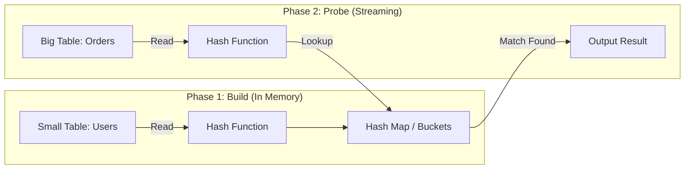

The Optimizer has finished its auction. It has looked at the statistics, calculated the cost, and handed down a set of blueprints. Now, the **Execution Engine** (the muscle) has to actually do the heavy lifting.

Data engineers often write `JOIN` without thinking. It feels like a logical operation, "Connect A to B." But physically, there are three very different ways to mechanically connect two datasets. The engine must pick the right tool for the job.

If you pick the wrong tool—like using a screwdriver to pound in a nail—you will spend hours doing work that should have taken seconds.

## 7.1 Nested Loop Joins: The Brute Force Approach
The **Nested Loop Join** is the oldest, simplest, and most intuitive algorithm in the database. If you were asked to write a program to join two lists of data in Python or Java without using any libraries, this is exactly what you would write.

### The Algorithm: A Loop Inside a Loop
Imagine you are a teacher with two lists:

1. **Outer List**: A list of 5 students who failed the exam.
2. **Inner List**: A file cabinet containing the permanent records of all 10,000 students in the school.

Your job is to find the phone numbers for those 5 students.

How do you do it?

1. You pick the first name from your "Failed" list (Outer).
2. You walk over to the file cabinet (Inner) and search for that student.
3. You find a match? Great, write down the phone number.
4. You move to the second name on the "Failed" list.
5. Repeat until done.

In pseudo-code, it looks exactly like this:

```python
# The "Nested Loop"
for outer_row in Small_table:
    for inner_row in Large_Table:
        if outer_row.id ==  inner_row.id:
            emit(outer_row, inner_row)
```

### The Physics: Why It Works (and When It Fails)
The performance of a Nested Loop Join is defined by simple math: $N \times M$.

If the Outer Table has $N$ rows and the Inner Table has $M$ rows, the engine effectively performs $N \times M$ iterations.

**Scenario A: The Good (Small Data)**

- **Outer table**: 10 rows.
- **Inner table**: 1,000 rows.
- **Total operations**: $10 \times 1,000 = 10,000$ checks.
- **Time**: microseconds.
- **Verdict**: This is lightning fast. It requires almost no memory setup (no hash maps to build, no sorting to do). It starts streaming results immediately.

**Scenario B: The Bad (Big Data)**

- **Outer table**: 100,000 rows.
- **Inner table**: 100,000 rows.
- **Total operations**: $100,000 \times 100,000 = 10,000,000,000$ (10 billion checks).
- **Time**: hours.
- **Verdict**: The CPU melts. This is the "Cartesian Product" nightmare.

### The Savior: Index Nested Loop Join
The standard Nested Loop described above (scanning the inner table every time) is rarely used because it is so slow. However, the **Index Nested Loop Join** is one of the most powerful tools in the engine.

Let's go back to the teacher analogy. If the file cabinet is disorganized (Heap), you have to search the whole cabinet for every student. But if the file cabinet is **Alphabetized** (indexed), you don't scan it. You perform a **Seek**.

- Pick Student 1 --> **Index Seek** (3 hops). Found.
- Pick Student 2 --> **Index Seek** (3 hops). Found.

Now the math changes from $N \times M$ to $N \times \log{M}$.

- **Outer**: 100,000 rows.
- **Inner**: 10 million rows (indexed).
- **Cost**: 100,000 lookups.
- **Verdict**: Viable!

### The Mechanic's Checklist
When you see a `NESTED LOOP` in your execution plan.

1. **Check the Inputs**: Is the "Outer" table (the driver) relatively small? It should be.
2. **Check the Inner**: Does the "Inner" table have an index on a joining column? If not, you are doing a "Naive Nested Loop," which is a performance killer.
3. **The Cardinality Trap**: If the Optimizer *thought* the Outer table was small (1 row) but it was actually huge (1 million rows), this join will hang your system. This is the classic symptom of stale statistics.

!!! tip "Rule of Thumb"

    **Nested Loop** is for **Small Table JOIN Large Table (Indexed)**. It is low overhead and fast for OLTP queries (e.g., "Get the order details for *this specific user*"). It is usually terrible for Analytical queries (e.g., "Join all Sales to all Customers").

## 7.2 Hash Join: The Heavy Lifter
In the world of data engineering, analytics, and data warehousing, the **Hash Join** is the default standard. If you are joining two massive tables without indexes, this is the algorithm the engine will choose 99% of the time.

### The Problem with Loops
Recall the Nested Loop: for every row in Table A, scan Table B. If Table A has 1 million rows and Table B has 1 million rows, that is 1 trillion comparisons. Even with an index, the random hopping back and forth (seeking) is too slow for scanning entire tables.

We need a way to do this without "seeking" and without repeating work. We need a strategy that touches every row exactly once.

**The Algorithm: Build and Probe**

The Hash Join is a two-phase operation. It trades **Memory (RAM)** for **Speed**.

### Phase 1: The Build Phase
The Optimizer identifies the **smaller** of the two tables (let's say `Users` is smaller than `Orders`). It reads this entire table into memory.

As it reads the rows, it runs the Join Key (e.g., `User_ID`) through a **Hash Function**. This function converts the ID into a memory address—a specific "bucket" in RAM.

- Row: `(ID: 105, Name: "Alice")`
- Hash(105) -> `Bucket 5`
- Action: Store "Alice" in Bucket 5.

By the end of this phase, the engine has built a **Hash Table** in RAM containing every entry from the smaller table, organized for instant retrieval.

### Phase 2: The probe Phase
Now the engine starts reading the **larger** table (`Orders`). It reads this table sequentially, from start to finish. It does *not* load this table into memory; it just streams it one row at a time.

For every order, it takes the `User_ID` and runs the **same Hash Function**.

- Order Row: `(Order: 999, User_ID: 105)`
- Hash(105) -> `Bucket 5`
- Action: Look in Bucket 5. Is there a user there? **Yes, Alice**.
- Result: Emit the joined row.



### The Physics: Why It's Fast
The magic of the Hash Join is its time complexity: $O(N + M)$.

- It reads Table A once ($N$).
- It reads Table B once ($M$).
- It performs the join.

There is no looping back. There is no disk seeking. It is pure sequential throughput. This is why Spark and Snowflake love Hash Joins—they allow the engine to rip through petabytes of data at the speed of the disk bandwidth.

### The "Startup Cost"
If you run a query using a Hash Join, you might notice a delay before the first result appears.

- **Nested Loop**: Returns row #1 immediately.
- **Hash Join**: Returns nothing until the **Build Phase** is complete.

The engine *must* read the entire small table into RAM before it can process a single row of the large table. If your "small" table takes 5 minutes to read, your query sits at 0% for 5 minutes.

!!! warning "The Memory Cliff"

    The Hash Join assumes the **Build Side** (the smaller table) fits in RAM.

    If you allocate 1 GB of memory for the join, but your `Users` table is 2 GB, the Hash Map won't fit. The database can't just "stop." It has to spill the overflow to disk (using Temp Space).

    We will cover this disaster at the end of this module, but for now, know this: **Hash Joins are memory hogs.**

## 7.3 Sort-Merge Join: The Zipper
If the Nested Loop is a sniper and the Hash Join is a Harvester; the **Sort-Merge Join** (often just called a Merge Join) is a Zipper.

It is an algorithm of elegance and order. It is incredibly efficient, but it has a very strict requirement: **Discipline**. It refuses to work with chaotic, unsorted data.

### The Algorithm: Flipping Cards
Imagine two decks of cards that are sorted but **incomplete**.

- **Deck A (Left)**: `2, 4, 7, 10` 
- **Deck B (Right)**: `3, 4, 7, 9`

**The Procedure**:

1. **Flip**: Left shows `2`, Right shows `3`.
2. **Compare**: `2 < 3`
3. **Logic**: Since Deck B is sorted and currently showing `3`, it is physically impossible for Deck B to contain a `2`  further down the stack. We can safely discard the `2` from Deck A without looking any further.
4. **Advance Left**: New Left card is `4`.
5. **Compare**: `4 > 3`. Now the Right side is "behind."
6. **Advanced Right**: New Right card is `4`.
7. **Compare**: `4 == 4`. Match!

That "discarding" logic is the key. It allows the engine to skip huge chunks of non-matching data efficiently.

### The Physics: The Cost of Order
The joining part is blindingly fast—linear speed $O(N + M)$. It uses very little memory because it doesn't need to build a hash map; it just needs to hold two rows in memory at a time to compare them.

So why isn't it the default?

Because data is rarely sorted.

If you throw two random heaps of data at the engine and ask for a Merge Join, the engine first has to **Sort** both tables.

- Sorting is expensive ($O(N \log{N})$).
- Sorting requires CPU.
- Sorting requires memory (Sort Buffer).

If the engine has to sort the data *just* to run the join, the **Hash Join** is usually faster. Building a Hash  Map is generally cheaper than sorting the whole dataset.

### The Sweet Spot: Presorted Inputs
The Sort-Merge Join shines when the data is **already sorted**. This happens more often than you think.

1. **B-Tree Indexes**: If you are joining on a Primary Key or an Indexed column, the B-Tree provides the data in sorted order automatically. The engine doesn't have to sort anything; it just reads the index leaves.
2. **Clustered Tables**: In many databases (SQL Server or Clustered tables in Postgres/Snowflake), the table is physically stored in sorted order.
3. **The Window Function Effect**: If you have a subquery that already has an `ORDER BY` clause, the optimizer sees the data coming out of that step is sorted and might choose a Merge Join for the next step.

!!! info "The Non-Equi Join"

    There is one special case where Merge Join is king.

    **Hash Joins only work for "Equals" (`=`).** You cannot build a hash bucket for "Greater Than."

    If you have a Range Join (e.g., `Start_Time < Event_Time < End_Time`), the Hash Join fails. The Nested Loop is too slow. The **Sort-Merge Join** is the only efficient algorithm that can handle inequalities smartly, provided the data is sorted by time.

## 7.4 Spilling to Disk: The "Temp Space" Killer
We have talked about Hash Joins and Sorting as if memory (RAM) is infinite. In the cloud, we like to pretend resources are limitless.

But in physics, a container has a limit.

When you run a **Hash Join** on two massive tables, the database attempts to build a Hash Map of the "smaller" table in RAM. But what if you allocated 1 GB of memory for the query (`work_mem`), and that "small" table is actually **5 GB**?

The engine faces a crisis. It cannot fit the data in the bucket. It cannot stop the query. So, it effectively "vomits" the excess data onto the hard drive.

This is called **Spilling to Disk** (or "Temp Spill").

### The Physics of the Spill
This is the single most common reason why a query that usually takes 10 seconds suddenly takes 20 minutes.

Remember the speed hierarchy from module 1?

- **RAM Access**: ~100 nanoseconds.
- **Disk Access (SSD)**: ~100,000 nanoseconds.

When a join spills, the operation downgrades  from "Memory Speed" to "Disk Speed." You have introduced a mechanical bottleneck into a logic operation.

**How it Mechanically Works**:

1. **Partitioning**: The engine realizes the Hash Map won't fit. It splits the data into smaller "partitions."
2. **Write**: It keeps Partition 1 in RAM and writes Partition 2-10 to the **Temp Disk** (a scratchpad area on the hard drive).
3. **Process**: It finishes the join for Partition 1.
4. **Swap**: It clears RAM, reads Partition 2 from the disk (Slow!), and processes it.
5. **Repeat**: It does this for every partition.

### Diagnosing the Spill
You don't need to guess if this is happening. The database tells you, but usually in the fine print.

#### In Postgres (EXPLAIN ANALYZE):

```plaintext
Hash Join  (cost=...)
  Hash Cond: (t1.id = t2.id)
  ->  Seq Scan on large_table t2
  ->  Hash
        Buckets: 65536  Memory Usage: 1024kB
        DISK: 52000kB  <-- THE SMOKING GUN
```

If you see the **DISK** (or **Spill**) inside a Hash or Sort operator, your query is bleeding out.

**In Snowflake**: In the Query Profile, look for a statistic called "**Bytes Spilled to Local Storage**" or "**Bytes Spilled to Remote Storage**".

- **Local Spill**: Bad. (Spilling to the SSD on the worker node).
- **Remote Spill**: Catastrophic. (The SSD filled up, and it spilled to S3/Blob storage over the network).

### The Fix: How to Stop the Bleeding
When you see a spill, you have two mechanic's levers to pull:

1. **Increase Memory (`work_mem`)**: If the spill is small (e.g., you need 1.1 GB but had 1 GB), just giving the query a bit more RAM will eliminate the disk I/O entirely. The query speed will jump 100x instantly.
2. **Reduce the Dataset (Filter Early)**: Why is the table 5 GB? Do you really need to join *all* the data?
    - *Bad*: Join `Orders` and `Users`, *then* filter for `Date = Today`.
    - *Good* Filter `Orders` for `Today` *first*, then join. By shrinking the input **before** it hits the Hash Build phase, you ensure the data fits in the bucket.

## Quiz

<quiz>
Which join algorithm acts like a 'Loop inside a Loop' and effectively performs a Cartesian Product ($N \times M$) if no indexes are present?
- [ ] Sort-Merge Join
- [x] Nested Loop Join
- [ ] Broadcast Join
- [ ] Hash Join

</quiz>

<quiz>
In what specific scenario is an Index Nested Loop Join typically the fastest option?
- [ ] When the data is already physically sorted on disk.
- [ ] Joining two massive, unsorted Fact T ables (e.g., Sales and Inventory).
- [ ] When the query involves a non-equi join (e.g., `>`  or `<`).
- [x] Joining a smaller Outer table (e.g., 10 rows) to a large Inner table that is indexed.

</quiz>

<quiz>
The Hash Join operates  in two distinct phases. What are they?
- [ ] Sort and Merge.
- [x] Build and Probe.
- [ ] Lock and Load.
- [ ] Seek and Scan.

</quiz>

<quiz>
Why is the Hash Join considered the "Workhorse" of Data Engineering and Analytics (OLAP)?
- [ ] It uses the least amount of memory of all algorithms.
- [ ] It works effectively with `LIKE` and `>` operators.
- [ ] It returns the first row of data immediately.
- [x] It handles large, unsorted datasets with linear speed ($O(N + M)$) by avoiding random disk seeks.

</quiz>

<quiz>
What is the strict requirement for a Sort-Merge Join to function efficiently without extra overhead?
- [x] Both input datasets must be sorted by the join key.
- [ ] One table must be small enough to fit in RAM.
- [ ] The tables must be on different physical disks.
- [ ] THe join condition must be an inequality (`!=`).

</quiz>

<quiz>
You are joining two tables based on a time range: `Start_Time < Event_Time < End_Time`. Which algorithm is likely the best choice?
- [ ] Cartesian Product.
- [x] Sort-Merge Join.
- [ ] Hash Join.
- [ ] Bitmap  Scan.

</quiz>

<quiz>
What specifically causes a 'Spill to disk' (Temp Spill) during a Hash Join?
- [ ] The query contains too many columns.
- [ ] The hard drive is full.
- [ ] The join keys are not integers.
- [x] The 'Build' side (smaller table) is larger than the allocated memory (`work_mem`).

</quiz>

<quiz>
If you observe "Disk Spill" in your query plan, what is the immediate impact on performance?
- [ ] The query fails with an Out of Memory error.
- [x] The operation downgrades from RAM speed (ns) to Disk speed (ms), often causing 100x slowdown.
- [ ] The data becomes corrupted.
- [ ] The query automatically switches to a Nested Loop Join.

</quiz>

<quiz>
Which of the following is a valid "Mechanic's Fix" to prevent a Hash Join from spilling to disk?
- [ ] Defragment the hard drive.
- [ ] Remove the index on the join column.
- [ ] Switch to a Cross Join.
- [x] Filter the data earlier (e.g., in a CTE or subquery) to reduce the size of the input table.

</quiz>

<quiz>
You run a query. For the first 2 minutes, nothing happens (0 rows returned). Then, suddenly, thousands of rows stream out. Which join algorithm was likely used?
- [ ] Limit clause.
- [x] Hash Join.
- [ ] Index Seek.
- [ ] Nested Loop Join.

</quiz>

<!-- mkdocs-quiz results -->

## Lab
Please complete module 7's lab in the companion GitHub repository.