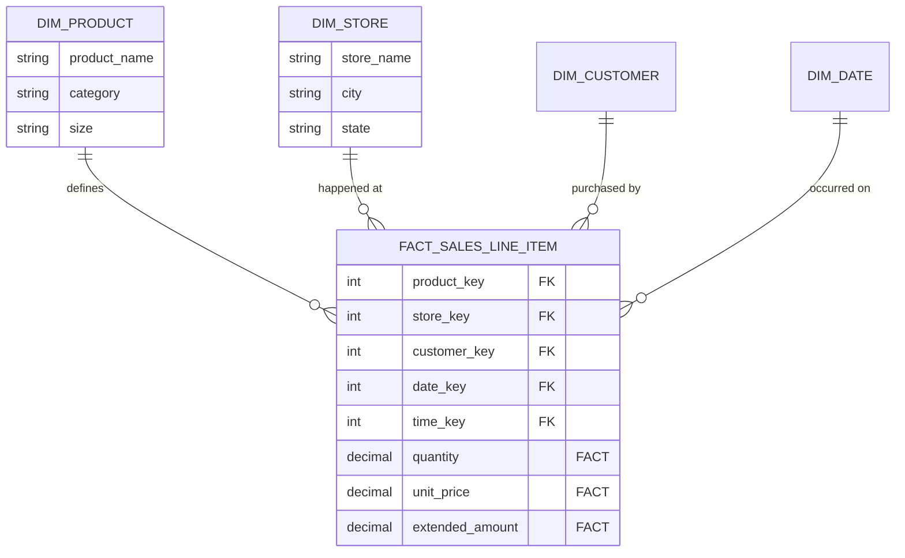

We have spent the entire course assembling a toolkit. You know what a *fact** is (the measurement). You know what a **dimension** is (the context). You know how to arrange them into **Star Schemas** to keep your queries fast and your storage sane.

But having a toolbox isn't the same as knowing how to build a house. If I handed you a saw, a hammer, and a pile of lumber, you wouldn't necessarily build a stable structure. You need a blueprint. You need a process.

In data modeling, paralysis often strikes at the start. You stare at a blank whiteboard and a messy database dump from the application team and think, *Where do I even begin? Do I make a Customer table first? Or do I start with the Revenue numbers?*

To break this paralysis, we use the "**Kimball 4-step Process**." This is the algorithm for turning chaos into order. It works for the Omni-coffee shop, it works for tech giants, and it will work for you.

## 15.1 The 4-Step Process
Designing a dimensional model is a lot like journalism. You are trying to capture a story—the story of what your business did. To tell that story accurately, you need to answer specific questions in a specific order.

The order matters. If you try to answer, "How much money did we make?" (Step 4) before you decide, "What exactly are we counting?" (Step 2), you will build a bridge to nowhere.

Here is the loop you will run for every single model you build:

1. Select the Business Process.
2. Declare the Grain.
3. Identify the Dimensions.
4. Identify the Facts.

Let's walk through this using our Omni-Coffee empire.

### Step 1: Select the Business Process
The first mistake beginners make is trying to model a **Department** instead of a **Process**.

You might hear a stakeholder say, "We need a dashboard for the Sales department." Your instinct might be to build a massive "Sales" table that includes everything salespeople care about: quota targets, leads, closed deals, and monthly revenue.

**Don't do that**.

A "Department" is a political boundary; it changes when the VP gets fired. A "Business Process" is a physical activity; it happens regardless of who is in charge.

We want to model a specific operational activity. For Omni-Coffee, we aren't modeling "Sales." We are modeling **POS Retail Transactions**. This is the physical act of a barista taking an order, tapping a screen, and collecting money.

!!! tip "Verbs Over Nouns"

    When selecting a process, look for the **Verb**.

    - **Bad**: "Marketing" (A department).
    - **Good**: "Campaign Ad Serving" (A process).
    - **Bad**: "Inventory" (A concept).
    - **Good**: "Receiving & Shipment" (A process).

### Step 2: Declare the Grain
This is the most critical step. If you get this wrong, your queries will return garbage, and your users will lose trust in your data forever.

**The Grain** defines what a single row in your Fact table represents.

At Omni-Coffee, when a customer buys a latte and a muffin, the register generates a receipt. That receipt has a header (Transaction ID #555) and a list of items.

We have a choice to make:

1. **Header Grain**: One row per *receipt*.
2. **Line Item Grain**: One row per *item on the receipt*.

If we choose **Header Grain**, we can easily sum up the total money ($12.00). But what if we want to know how many muffins we sold? We can't see them easily because the muffins are hidden inside the total receipt amount.

If we choose **Line Item Grain**, we have one row for the latte and one row for the muffin. We can still calculate the total receipt (by summing the rows), but now we can also count the muffins.

!!! warning "The Cardinal Rule of Granularity"

    **Prefer the lowest possible level of detail (Atomic Grain).**

    You can always roll up atomic data (summing lines to get a receipt). You can **never** drill down into aggregated data (breaking a receipt back into lines) if you didn't store the lines in the first place.

For Omni-Coffee, we declare our grain: *One row per line item on a transaction receipt*.

### Step 3: Identify the Dimensions
Now that we know what a row *is*, we ask, **"Who, What, WHere, When, and Why?"**

These are your descriptive attributes. In step 2, we decided our fact table is a list of line items. Now, look at that list and pull out every noun that provides context.

- **Who bought it?** The `Customer`.
- **Who sold it?** The `Employee`.
- **What was bought?** The `Product` (Latte, Muffin).
- **Where was it bought?** The `Store`.
- **When was it bought?** The `Date` and `Time`.
- **How was it paid for?** The `Payment Method`.

These become our **dimension tables**. In our Star Schema, these are the tables that will surround the center.

### Step 4: Identify the Facts
Finally, we ask, **"What are we measuring?"**

We are looking for the numbers. The metrics. The things math happens to. Since we defined our grain as "One Line Item," our facts must be true for that specific line item.

- **Quantity**: How many of this item?
- **Unit Price**: How much per item?
- **Extended Sales Amount**: Quantity $\times$ Unit price.
- **Tax Amount**: The tax for this line item.
- **Discount Amount**: The discount applied to this line item.

!!! bug "The Mixed Grain Danger"

    Be careful not to include facts that belong to a different grain!

    For example, **"Total Receipt Amount"** does *not* belong on the Line Item row. If the receipt total was $20, and you put $20 on the "Latte" row and $20 on the "Muffin" row, when you sum them up, you'll think the total was $40.

    Keep the facts aligned with the declared grain.

### The Resulting Blueprint
By following these four steps, we have successfully drafted the schema for our `fct_sales` table without writing a single line of SQL. We moved from a vague request ("Analyze sales") to a concrete architectural design.

Here is what our design looks like conceptually:

In the real world, you will repeat this process dozens of times. You will have a process for `Inventory Snapshots`, a process for `Employee Shifts`, and a process for `Supply Chain Deliveries`.

But wait—if `fct_sales` uses the `dim_store` table, and `fct_inventory` also uses the `dim_store` table… do we make two store tables? Or do we share one?

That brings us to the **Bus Matrix**, the master plan for connecting these stars together.

## 15.2 The Bus Matrix
We just designed the **Retail Sales** model. It was a triumph. You have a beautiful Star Schema that tracks every latte sold.

Six months later, the Supply Chain team knocks on your door. They want to track **inventory**. They want to know how many pounds of coffee beans are sitting in the back room of the Seattle store versus the Portland store.

You rub your hands together. "I know that" you say.  You run the 4-step process.

1. **Process**: Inventory snapshot.
2. **Grain**: One row per product, per store, per day.
3. **Dimensions**: Date, Product, Store.
4. **Facts**: Quantity on Hand.

You build a new `dim_store` table for the supply chain team. You build a new `dim_product` table because their product names are slightly different from the marketing team's names.

**Stop**. You have just committed the original sin of data warehousing.

You have built a **Silo**.

### The Problem with Silos
If you build a separate Star Schema for every department in isolation, you end up with "Data drift."

- **Sales Report**: "We sold $5,000 at the 'Downtown' store."
- **Inventory Report**: "We have 0 stock at the 'Main St' store."

It turns out 'Downtown' and 'Main St' are the same building, but because you made two different `dim_store` tables, the computer treats them as two different entities. You cannot join Sales to Inventory to calculate 'Inventory Turnover' because the keys don't match.

### The Solution: Conformed Dimensions
To prevent this, we use **conformed dimensions**.

A conformed dimension is a dimension that is identical (or a strictly mathematical subset) across multiple fact tables. It is the "Standard Interface" for your data warehouse.

- There is only one `dim_date`.
- There is only one `dim_store`.
- There is only one `dim_product`.

When the Sales Fact table needs to talk about a store, it points to `dim_store`. When the Inventory Fact table needs to talk about a store, it points to the same `dim_store`.

This allows us to "Drill Across." We can run a query that pulls Sales data and Inventory Data and lines them up perfectly by Store, because they share the same store key.

### The Tool: The Bus Matrix
How do we plan this? We don't want to build a monolithic "Enterprise Model" that takes five years to design. We want to be agile.

We use the **Enterprise Bus Matrix**.

The name comes from computer hardware. In a PC, the "Bus" is the communication channel that allows different components (RAM, CPU, Hard Drive) to plug in and work together. In data, the Bus Matrix allows different business processes to plug into the same dimensions.

It is a simple grid:

- **Rows**: Business Processes (Facts).
- **Columns**: Dimensions.

Let's look at the Bus Matrix for Omni-Coffee.

| Business Process (Fact) | Date | Store | Product | Customer | Employee | Supplier | Promotion |
|:---|:---|:---|:---|:---|:---|:---|:--|
| Retail Sales | X | X | X | X | X | | X |
| Inventory Snapshot | X | X | X | | | | |
| Warehouse Deliveries | X | X | X | | | X |
| Employee Shifts | X | X | | | X | | |

### Reading the Matrix
This simple grid tells you the entire architectural strategy of your data warehouse.

1. **Vertical Integration (Columns)**: Look at the **Store** column. It has an **X** for almost every process. This tells you that `dim_store` is a critical, high-value dimension. You should build this first and build it carefully because everyone depends on it.
2. **Horizontal Integration (Rows)**: Look at **Retail Sales**. It connects to almost everything. It is a rich, complex process.
3. **The Gaps**: Look at the **Inventory Snapshot**. Notice there is no **X** for **Customer**. Why?
    - Because Inventory doesn't care who buys the coffee. It only cares that the coffee exists.
    - If you tried to force a `customer_key` into the Inventory table, the grain would explode. You can't have "Inventory for Bob."

### How to Use This in Real Life
When you start a new data project, do not start coding immediately.

1. **Draw the Matrix**: Create a spreadsheet. List your proposed process on the left.
2. **Audit Existing Dimensions**: Look at the existing `dim_` tables in your database. Can you reuse `dim_date`? Yes. Can you reuse `dim_product`? Probably.
3. **Fill the Gaps**: Does your new process require a dimension that doesn't exist yet? (e.g., `dim_supplier` for the Warehouse Deliveries process). If so, you need to design that new dimension.
4. Execute: Now you can build your new Fact table, linking to the old Conformed Dimensions and the new ones you just built.

By sticking to the Bus Matrix, you are building a modular system. You can add new Fact tables five years from now, and as long as they plug into the existing Dimensions, they will immediately integrate with all your historical data.

## Quiz

<quiz>
According to the Kimball method, what is the first step in the 4-step design process?
- [ ] Declare the grain
- [ ] Identify the dimensions
- [ ] Identify the facts
- [x] Select the business process

</quiz>

<quiz>
In the Omni-Coffee example, when selecting a business process to model, which of the following was the best choice for them?
- [ ] The Marketing Department
- [x] Retail POS Transaction
- [ ] Customer Data
- [ ] Quarterly Revenue Reporting

</quiz>

<quiz>
In the context of the 4-step process, what does 'Declaring the Grain' mean?
- [x] Defining what a single row in the Fact table represents.
- [ ] Calculating the total storage space required.
- [ ] Listing all the columns in the dimensions table.
- [ ] Deciding which database engine to use.

</quiz>

<quiz>
Why is it generally recommended to choose the lowest possible level of granularity (Atomic Grain)?
- [ ] It makes the ETL process faster.
- [ ] It consumes the least amount of storage space.
- [x] It allows you to roll up data to any level of aggregation later.
- [ ] It eliminates the need for dimension tables.

</quiz>

<quiz>
Which of the following attributes would most likely be found in a Fact table rather than a Dimension table?
- [ ] Product Category
- [x] Extended Sales Amount
- [ ] Store Name
- [ ] Customer Zip Code

</quiz>

<quiz>
What is a 'Conformed Dimension'?
- [ ] A dimension that has been normalized into 3rd normal form.
- [ ] A dimension that contains numerical measurements.
- [ ] A dimension that is completely unique to a single fact table.
- [x] A dimension that is shared identically across  multiple fact tables.

</quiz>

<quiz>
What is the primary risk of not using conformed dimensions (e.g., creating a separate store table for sales and another for inventory)?
- [ ] SQL queries will become too short.
- [ ] The database will run out of integer keys.
- [ ] The Star Schema will turn into a Snowflake Schema.
- [x] Creating Data Silos where reports from different departments cannot be integrated.

</quiz>

<quiz>
In the Enterprise Bus Matrix, what do the Rows generally represent?
- [x] Business Processes (Fact tables)
- [ ] Departments
- [ ] Time periods
- [ ] Dimension (Context)

</quiz>

<quiz>
Which of the following is an example of the 'Mixed Grain' error?
- [ ] Having a fact table with millions of rows.
- [ ] Storing the store address in the `dim_store` table.
- [x] Storing the 'Total Receipt Amount' on every line item row of a transaction.
- [ ] Joining a Fact table to a Dimension table.

</quiz>

<quiz>
What does the term 'Drill Across' refer to?
- [ ] Moving data from the Bronze layer to the Silver layer.
- [ ] Breaking a yearly report down into monthly numbers.
- [ ] Adding more columns to a fact table.
- [x] Querying two different fact tables using their shared conformed dimensions.

</quiz>

<!-- mkdocs-quiz results -->