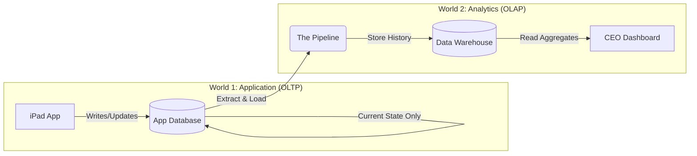
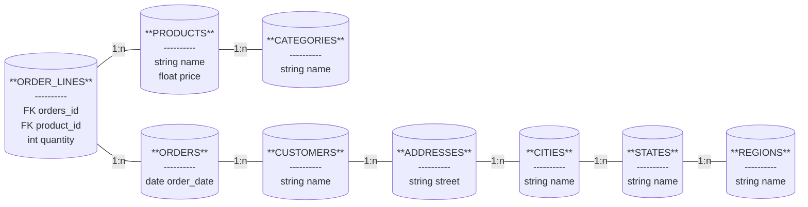

If you're reading this, you've survived the abstract peaks of Set Theory. You've learned how to think about data as collections of things—unions, intersections, and relations. You know what is *true*.

Now, we descend from the ivory tower into the engine room. We are leaving the realm of pure mathematics and entering the messy, loud, and pragmatic world of data engineering.

In Set Theory, a relation simply *is*. It doesn't cost money to store. It doesn't take milliseconds to scan. But in the real world, physics applies. Hard drives fill up. CPUs choke. Users get impatient.

This module is about trade-offs.

To understand why we design data the way we do, we first have to recognize that not all data problems are the same. In fact, there is a fundamental schism in our industry—a split between two worlds that look similar on the surface but have opposing goals.

We call these worlds **OLTP** and **OLAP**.

## 1.1 Application State vs. Business History
To explore these worlds, we're going to help run a business: **The Omni-Coffee Shop**.

We aren't just selling coffee; we are tech-enabled. We have a slick iPad application at the register (Point of sale), an inventory system in the back, and a mobile app for customers.

When a customer walks in and orders a "Double-shot Vanilla Latte," the software needs to do a few things immediately:

1. Check if we have vanilla syrup in stock.
2. Deduct the syrup and milk from inventory.
3. Create an order ticket for the barista.
4. Take the customer's money.

This is the domain of **application state**.

### World 1: Application State (OLTP)
The database backing up our iPad app has a very specific job: **Keep the business running right now**.

Technologists call this **OLTP** (Online Transaction Processing). The keyword here is *transaction*. The database must be fast, surgical, and accurate. When the barista marks the latte as "Completed," the database finds that specific order row and updates it.

Consider what the data looks like inside the iPad application's database.

!!! quote "The Application Mindset"

    "I don't care what the status of the order was five minutes ago. I only care about what it is *now* so I don't make the drink twice."

In the application database, we optimize for **writing** and **updating**. We want to store the "current state" of the world.

**Table: Orders (Application Database)**

| OrderID | Customer | Item | Status | Updated_At |
|:---|:---|:---|:---|:---|
| 101 | Alice | Latte | Completed | 08:05 AM |
| 102 | Bob | Espresso | Pending | 08:06 AM |

Notice what happened to Alice's order. Five minutes ago, the status was `Pending`. Then it was `Brewing`. Now it is `Completed`.

In an OLTP system, we typically **overwrite** the old state with the new state. Why? Because the iPad app doesn't need the history to function. It just needs to know if the customer is waiting or leaving. Saving every single state change would bloat the database and slow down the app.

This efficiency comes at a cost: **amnesia**.

### World 2: Business History (OLAP)
Six months later, the Omni-Coffee CEO storms into your office.

> "Our profits are down. I think the baristas are too slow. How lng does a 'Latte' sit in the 'Brewing' state compared to an 'Espresso'?"

You turn to your application database (OLTP) to answer the question. You look at Alice's row:

| OrderID | Customer | Item | Status | Updated_At |
|:---|:---|:---|:---|:---|
| 101 | Alice | Latte | Completed | 08:05 AM |

You are stuck. You know the order is complete. You know it was updated at 08:05. But you have absolutely no idea when it started brewing. That data was overwritten. It is gone forever.

This is why we require a second world: **business history**.

Technologists call this **OLAP** (Online Analytical Processing). The keyword is *Analytical*. This system doesn't run the cash register. It sits in the back office, watching, recording, and remembering.

In this world, we don't overwrite. We **append**. We track history. We treat data not as a "current state," but as a series of events.

If we had designed a database specifically for this question, it might look like this:

**Table: Order_History (Analytics Database)**

| EvenID | OrderID | Status_Change | Timestamp |
|:---|:---|:---|:---|
| 1 | 101 | Created | 07:55 AM |
| 2 | 101 | Brewing | 08:00 AM |
| 3 | 101 | Completed | 08:05 AM |

Now, answering the CEO is trivial arithmetic:

$$
\text{Brew Time } = 08:05 - 08:00 = 5 \text{ Minutes}
$$

### The Great Divide
You might be thinking, *"Why can't we just keep one big database that does both?"*

This is the great temptation of every junior engineer: "I'll just log the history to the app database!"

Here is the trade-off.

If you start stuffing millions of historical rows into the same database that powers the cash register, the cash register gets heavy. Queries start to drag. The database locks up while the CEO runs a massive report, and suddenly, customers can't pay for their coffee because the `Orders` table is busy calculating "Year-Over-Year Growth."

We separate these worlds because they have opposing physics:

| Feature | OLTP (Application State) | OLAP (Business History) |
|:---|:---|:---|
| Primary Goal | Process transactions fast. | Analyze trends deeply. |
| Data Nature | Current, volatile, changing. | Historical, static, additive. |
| Typical Operation | Read/Write 1 row at a time. | Read 1,000,000 rows at a time. |
| User | The Software / The Customer | The Analyst / CEO. |
| Analogy | The Cash Register | The Filing Cabinet |

### Visualizing the Data Flow
In this book, we are building the OLAP world. We assume the OLTP world already exists—it's the chaos of the daily business. Our job is to take that chaos, organize it, and store it in a way that makes history readable.

Here is how data moves from the Application to the Analytics world.

!!! abstract "The Engineers Mandate"

    Your job as a data engineer is to act as the bridge. You take the ephemeral, constantly changing **state** from the application and crystallize it into permanent **history** in the warehouse.

## 1.2 The Normalization Trap
When you first build a data pipeline, the most natural instinct is to be a photocopier. You look at the production database, you see fifty tables, and you say, "I will simply copy these fifty tables into my warehouse."

It feels safe. It feels accurate. It is also a trap.

To understand why, we have to talk about **normalization**.

### The Theory of "One Place"
Application developers are obsessed with **Third Normal Form (3NF)**. If you have a computer science degree, you probably have nightmares about this. If you don't, here is the crash course: **Normalization is the art of shredding data into tiny pieces to avoid duplicate information**.

Let's look at the Omni-Coffee application database again. How do we store a customer's address?

In a naive, un-normalized spreadsheet, you might write:

| Customer | City | State | Region |
|:---|:---|:---|:---|
| Alice | Fort Wayne | Indiana | Midwest |
| Bob | Fort Wayne | Indiana | MIdwest |

A software engineer looks at this and screams. Why? Because we wrote "indiana" twice. We wrote "Midwest" twice.

If the government decides to rename "Indiana" to "Hoosierland," the engineer has to find *every single row* where "Indiana" appears and update it. If they miss one, the database becomes inconsistent. One row says Indiana, another says Hoosierland. The application breaks.

To fix this, the engineer **normalizes** the data. They break it apart until every fact lives in exactly one place.

1. Create a `Regions` table.
2. Create a `States` table that links to `Region`.
3. Create a `Cities` table that links to `State`.
4. Create a `Customers` table that links to `Cities`.

Now, if Indiana changes its name, they update *one row* in the `States` table, and magically, every customer is updated. It is elegant. It is pure.

It is also a nightmare for you.

### The Spiderweb Schema
Let's look at what a simple request—"Show me a list of orders"—looks like in a highly normalized OLTP database.

This is called a **snowflake** structure (but the bad kind—we'll discuss the "good" kind later). Instead of a neat web, it looks like a central hub with long, sprawling branches extending outward.

### The Query from Hell
The CEO comes back. They want a report: "Total Sales of 'Robusta Beans' in the 'Midwest' Region."

In your normalized warehouse, you have to reconstruct reality. The data you need is scattered across **eight different tables**. To answer the question, the database engine has to perform a **JOIN**.

To get from `Order_Lines` (where the money is) to `Regions` (where the filter is), the database must:

1. Grab the `Order_Line`.
2. Hop to `Order` to get the Customer ID.
3. Hop to `Customer` to get the address ID.
4. Hop to `Address` to get the City ID.
5. Hop to `City` to get the State ID.
6. Hop to `State` to get the Region ID.
7. Finally check: "Is this the Midwest?"

Now, imagine doing this for 100 million orders.

Your database engine isn't reading data anymore; it's playing hopscotch. It is frantically jumping between random spots on the hard drive, stitching tiny scraps of information to build a single row of results.

!!! failure "The Performance Penalty"

    In data engineering, **joins are expensive**. Every time you join two massive tables, the database has to line them up, compare keys, and merge rows.

    If you force the database to join 8 tables just to figure out where a customer lives, your dashboard won't load in 200 milliseconds. It will load in 20 minutes.

### The Trade-Off: Write vs. Read
Why did the application developers do this to us? Are they masochists?

No. They are optimizing for **write speed** and **consistency**.
- **OLTP Priority**: When a customer updates their profile, the app needs to write that change instantly. Normalization makes *writes* fast because you only touch one tiny table.
- **OLTP Penalty**: *Reads* are slow and complex, but that's okay because the app usually only reads one customer at a time.

We are in the **OLAP** world now. Our priorities are flipped.
- **OLAP Priority**: We need to read millions of rows instantly to calculate aggregates.
- **OLAP Penalty**: We don't care if *writes* are slow (we typically load data in big batches anyway). We don't care if data is redundant.

### The Solution: Break the Rules
To make our data warehouse fast, we have to do something that feels dirty to a classically trained computer scientist.

We are going to **de-normalize**.

We will take those `Region`, `State`, and `City` tables, and we are going to squash them back into the `Customer` table. We will intentionally duplicate data. We are going to write "Indiana" ten thousand times.

Why?

So that when the CEO asks for "Sales in Indiana," the database doesn't have to hop through five tables. It just scans the `Customer` table, sees "Indiana," and grabs the money.

We are trading **storage space** (redundancy) for **query speed** (performance).

## 1.3 The Read-Optimized Mindset
You now understand that application databases are designed to be surgically precise (OLTP), while analytical databases are designed to be sweeping and broad (OLAP).

To build a good data model, you have to fundamentally change how you think about "reading" a book.

### The Library Analogy
Imagine a massive library representing your database.

**The OLTP Mindset (The Librarian)**: A patron walks in and asks, "I need the book '*The Great Gatsby*'." The librarian doesn't walk shelf-to-shelf reading every spine. That would take years. Instead, they walk to the card catalog (the index), look up 'Gatsby,' find the exact shelf location (row ID), walk straight there, and pull the book.

- **Metric**: Time to find one item.
- **Strategy**: Ignore 99.99% of the library; find the 0.01% that matters.

**The OLAP Mindset (The Analyst)**: The CEO walks in and asks, "What is the average number of pages in all Fantasy books published between 1990 and 2000?" The card catalog is useless here. Knowing *where* the books are doesn't help you count their pages. You have to walk to the Fantasy section, pull **every single book** off the shelf, open it, check the publication date, and if it matches, check the page count.

- **Metric**: Time to process thousands of items.
- **Strategy**: Ignore the individual identity of the book; focus on the *attributes* of the group.

### Throughput vs. Latency
In the read-optimized world, we stop caring about **latency** (how fast can I get the first row?) and start obsessing over **throughput** (how many rows can I chew through per second?).

When we design tables for the warehouse, we assume that every query will touch a significant portion of the table.

!!! tip "The I/O Physics"

    Hard drives (and even SSDs) hate jumping around. They love streaming continuous blocks of data.

    - **OLTP Design**: Scatter data around so we can insert new bits easily. (Jumping is okay because we only fetch one row).
    - **OLAP Design**: Pack related data tightly together so we can suck it up like a vacuum cleaner.

The mindset shift dictates how we build our tables. We don't build them for the exception; we build them for the aggregate. We assume the user isn't asking "Who is User 42?", but rather "How many users churned last month?"

## 1.4 The Data Warehouse
So, where do we put these massive, denormalized, read-optimized tables? We don't put them back in the Postgres database running the app. We put them in a **data warehouse**.

The data warehouse is the container for the dimensional models we are about to build. It is a specialized database engine designed specifically for the "heavy lifting" of analytics.

Examples you might see in the wild include **Snowflake, Google BigQuery, Amazon Redshift or Databricks**. While they all have different logos, they share the same architectural DNA:

1. **Separation of Compute and Storage**: They store petabytes of data on cheap disks (like S3 or Google Cloud Storage) and spin up massive clusters of CPUs only when you run a query.
2. **Columnar Storage** (We will dive into this later in module 8, but for now, know that they store data in vertical columns, not horizontal rows).
3. **Dialect**: They speak SQL (Structured Query Language).

### The "Single Source of Truth"
The warehouse is not just a technical bucket; it is a political entity.

In any company, different departments have different "truths."

- **Marketing** thinks a "Customer" is anyone who visited the website.
- **Sales** thinks a "Customer" is anyone who signed a contract.
- **Finance** thinks a "Customer" is anyone who actually paid an invoice.

If these three teams pull data from three different raw sources, they will walk into the board meeting with three different revenue numbers. Arguments ensue. Trust erodes.

The data warehouse is where we resolve these disputes *in code*.

We take the raw data from Marketing, Sales, and Finance, and we model it into a single, governed table called `dim_customer`. We decide, once and for all, what the definition is.

!!! success "The Goal"

    The data warehouse exists to be the **single source of truth**. When we model data, we are not just organizing files; we are codifying the business logic so that everyone agrees on reality.

## Quiz

<quiz>
What is the primary operational goal of an OLTP (Online Transaction Processing) system?
- [ ] To serve as the single source of truth for all business reporting.
- [ ] To store data in a denormalized format to optimize read speeds.
- [x] To process individual, current state transactions as quickly and accurately as possible.
- [ ] To analyze historical trends over long periods of time.

</quiz>

<quiz>
In the context of the 'Omni-Coffee' example, why is the application database (OLTP) described as having 'amnesia'?
- [ ] It deletes data immediately after a transaction is completed to save space.
- [ ] It uses volatile memory that is wiped whenever the server restarts.
- [x] It typically overwrites old values with new status updates, losing the history of previous states.
- [ ] It separates data into too many tables, making it hard to remember where data is stored.

</quiz>

<quiz>
Why do application developers heavily use Third Normal Form (3NF) in OLTP databases?
- [x] To ensure consistency and speed up write operations by updating data in only one place.
- [ ] To make analytical queries faster by reducing table size.
- [ ] To enable the database to scan millions of rows efficiently.
- [ ] To duplicate data across multiple tables for safety.

</quiz>

<quiz>
What is the 'Query from Hell' scenario described in the text?
- [ ] A query written in an outdated version of SQL.
- [ ] A query that returns zero results because the data hasn't loaded yet.
- [ ] A query that accidentally deletes production data.
- [x] An analytical request requiring the database to join many tables to filter by a simple attribute.

</quiz>

<quiz>
When moving from OLTP to OLAP, what is the fundamental trade-off regarding data structure?
- [x] We trade storage space (redundancy) for query speed (performance).
- [ ] We trade security for accessibility. 
- [ ] We trade write speed for storage space.
- [ ] We trade accuracy for speed.

</quiz>

<quiz>
Which analogy best describes the 'Read-Optimized Mindset' (OLAP) compared to the Librarian (OLTP)?
- [x] Scanning every book on a shelf to calculate the average page count.
- [ ] Checking out a book and returning it on time.
- [ ] Using a card catalog to find a single specific book.
- [ ] Sorting books alphabetically by author name.

</quiz>

<quiz>
What is the primary metric of success for an Analytical (OLAP) database?
- [x] Throughput: How many rows can be processed per second?
- [ ] Concurrency: How many users can write to the database at once?
- [ ] Latency: How fast can I retrieve the first row?
- [ ] Uptime: How long has the server been running?

</quiz>

<quiz>
Why is the data warehouse referred to as the 'single source of truth'?
- [ ] Because it is the only database that allows writing data.
- [ ] Because it deletes any data that contradicts the CEO's opinion.
- [x] Because it forces a consistent definition for business terms across different departments.
- [ ] Because it stores data in a raw, unedited format.

</quiz>

<quiz>
What is 'denormalization'?
- [ ] Moving data from an on-premise server to the cloud.
- [x] Combining separate tables into fewer, wider tables, intentionally creating redundancy.
- [ ] Breaking large tables into smaller, linked tables to avoid redundancy.
- [ ] Cleaning data to ensure all phone numbers follow the same format.

</quiz>

<quiz>
Which of the following technologies is NOT typically classified as an OLAP data warehouse?
- [ ] Google BigQuery
- [x] PostgreSQL (configured for transactional apps)
- [ ] Amazon Redshfit
- [ ] Snowflake

</quiz>

<!-- mkdocs-quiz results -->