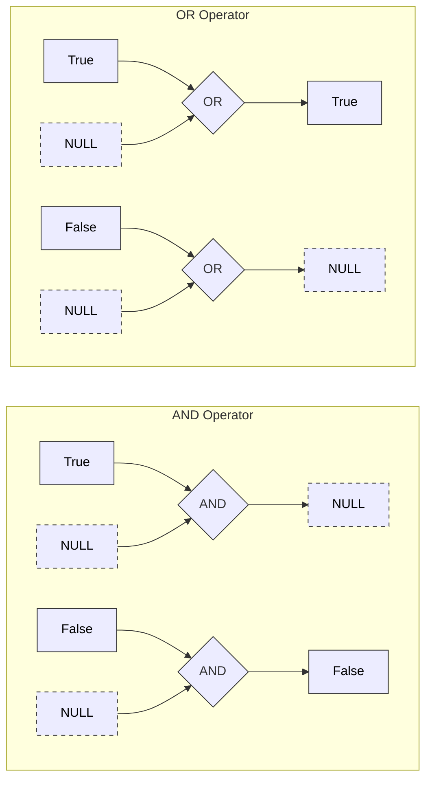

We have reached the part of the course where the clean, beautiful logic of Set Theory collides with the messy reality of magnetic storage.

In the previous sections, we lived in a binary world. An element was either in the set or out. A condition was either True or False. It was a paradise of certainty.

But life isn't certain. Occasionally, you ask a user for their age, and they don't answer. Occasionally, a sensor fails to record a temperature. Occasionally, the data simply isn't there yet.

To handle this, database engineers invented a placeholder. They called it **NULL**.

It was a mistake.

(Okay, maybe not a mistake, but definitely a headache). Sir Tony Hoare, the inventor of the null reference, calls it his "Billion Dollar Mistake." In data engineering, it is the source of approximately 90% of the bugs that will wake you up at 2 AM.

## 6.1 The NULL Value
First, let's define what NULL is by defining what it is **not**.

### The Box Analogy
Imagine we are back at *Club S*. We are looking at the guest list.

1. **The Value "0"**: There is a column for "Numbers of Drinks Ordered." Next to Bob's name, there is a 0. This is a specific, known fact. Bob has ordered zero drinks.
2. **The Empty String ""**: There is a column for "Middle Name." Alice has a blank space there because she explicitly said, "I don't have a middle name." This is a known fact. Her middle name is the empty string.
3. **NULL**: There is a column for "Phone Number." Next to Charlie's name, the field is blank. Does Charlie have a phone? Possibly. Did he forget to write it down? Possibly. Did he refuse to tell us? Possibly.

**NULL is not a value. NULL is a state of Unknown**.

In Set Theory, if we have a domain of integers $\mathbb{Z}$, NULL is not in that set. It is a marker that sits outside the domain, effectively saying, "A value belongs here, but I don't know what it is yet."

### The "Equal" Fallacy
Because NULL represents an "Unknown," it breaks the fundamental law of identity.

If I have an empty box in my left hand and a mystery box in my right hand, are the contents equal? I don't know. They might both contain a car. One might contain a cat and the other a bomb.

Therefore, in data logic:

$$
NULL = NULL \to Unknown
$$

You cannot say two NULLs are equal. You also cannot say they are not equal ($NULL \ne NULL$ is also Unknown). They are just two strangers in the dark.

## 6.2 Three-Valued Logic (3VL)
Because NULL is "Unknown," it forces us to expand our Boolean logic system. We can no longer survive with just True and False. We must introduce a third state, unknown (U).

This is called **three-valued logic**.

When you mix valid data with NULLs using `AND` and `OR`, the results can be counterintuitive. You have to think like a pessimist.

### The Truth Tables of the Unknown
Let's play "What if?" Replace **NULL** with "A Mystery Value (maybe True, maybe False)."

**1. The AND Operator ($\land$)**

- **True AND NULL**:
  - If the mystery box is True $\to$ Result is True.
  - If the mystery box is False $\to$ Result is False.
  - *Conclusion*: We don't know. Result is NULL.
- **False AND NULL**:
  - If the mystery box is True $\to$ Result is False (because False dominates AND).
  - If the mystery box is False $\to$ Result is False.
  - *Conclusion*: Result is **False**. (We don't need to open the box to know the whole expression fails).

**2. The OR Operator ($\lor$)**

- **True OR NULL**:
  - *Conclusion*: Result is True. (We already have one, True, so the box doesn't matter).
- **False OR NULL**:
  - If the mystery box is True $\to$ Result is True.
  - If the mystery box is False $\to$ Result is False.
  - *Conclusion*: Result is **NULL**.

!!! tip "The Cheat Sheet"

    - **AND** is logically strong. It only yields to certainty if one side is **False**. 
    - **OR** is logically optimistic. It yields to certainty if one side is **True**.
    - Otherwise, the **NULL** infects the results.

### The Visual Spread



## 6.3 The Dangerous Complement
Here is the trap that catches every junior engineer.

You want to find all users who do not live in "Paris." You write:

```sql
SELECT * FROM Users WHERE City != 'Paris';
```

The database engine looks at a row where the city is `NULL`. It evaluates the predicate:

$$
NULL \ne Paris
$$

Are the contents of the mystery box different from "Paris"?

- If the box contains "London" $\to$ Yes (True).
- If the box contains "Paris" $\to$ No (False).

Since the computer doesn't know, the result is **NULL (Unknown)**. And here is the kicker: **The `WHERE` clause only accepts True**. It discards False. It discards Unknown.

**Result**: The user with a NULL city vanishes. They are not in "Paris," but they are also not "Not in Paris." They are in the void.

### The `IS NULL` Predicate
Because standard comparison operators ($\eq$, $\ne$, $\lt$, $\gt$) fail when they touch **NULL**, we need a special tool to detect the void.

We cannot ask, "Is $x = NULL$?" because the answer is always unknown. We must ask "Is $x$ the NULL marker?"

In SQL, this is the `IS NULL` operator.

- `CITY IS NULL` $\to$ True.
- `CITY IS NOT NULL` $\to$ False.

This predicate restores order. It collapses the 3-valued logic back into 2-valued logic. It forces the mystery box to reveal itself as a mystery box.

## Quiz

<quiz>
Which of the following best describes `NULL` in the context of a database?
- [ ] A specific error code generated by the CPU.
- [x] A state representing an Unknown or missing value.
- [ ] The numeric value zero.
- [ ] A string containing no characters.

</quiz>

<quiz>
What is the result of the logical expression `NULL = NULL`?
- [ ] True
- [x] NULL (Unknown)
- [ ] 0
- [ ] False

</quiz>

<quiz>
In Three-Valued Logic, what is the result of `False AND NULL`?
- [ ] NULL (Unknown)
- [ ] True
- [x] False
- [ ] Error

</quiz>

<quiz>
In Three-Value Logic, what is the result of `True OR NULL`?
- [x] True
- [ ] NULL (Unknown)
- [ ] False
- [ ] Undefined

</quiz>

<quiz>
Why does the query `SELECT * FROM Users WHERE City != 'Paris'` exclude users with the `NULL` city?
- [ ] Because the database automatically converts NULL to an empty string.
- [x] Because `NULL != 'Paris'` evaluates to Unknown, and the WHERE clause only keeps rows that are True.
- [ ] Because `NULL` is functionally equal to 'Paris.'
- [ ] Because `NULL`s are stored in a separate table.

</quiz>

<quiz>
Which SQL predicate is specifically designed to check if a value is NULL?
- [ ] `= NULL`
- [x] `IS NULL`
- [ ] `EQUALS NULL`
- [ ] `== NULL`

</quiz>

<quiz>
What is the result of `NOT (NULL)`?
- [ ] True
- [ ] False
- [x] NULL (Unknown)
- [ ] The Universal Set

</quiz>

<quiz>
What happens if you try to `COUNT` a column that is full of NULLs using `COUNT(columnName)`?
- [ ] It returns NULL.
- [x] It returns 0 (ignores the NULLs).
- [ ] It counts all the rows including the NULLs.
- [ ] It throws an error.

</quiz>

<quiz>
If you have a boolean column `IsActive` containing `(True, False, NULL)`, what does `WHERE IsActive = True` return?
- [ ] Nothing.
- [ ] The `True` rows and the `NULL` rows.
- [ ] The `True` rows and the `False` rows.
- [x] Only the `True` rows.

</quiz>

<quiz>
Who referred to the invention of the NULL reference as his "Billion Dollar Mistake"?
- [ ] Ada Lovelace
- [ ] Edgar F. Codd
- [x] Tony Hoare
- [ ] Alan Turing

</quiz>

<!-- mkdocs-quiz results -->