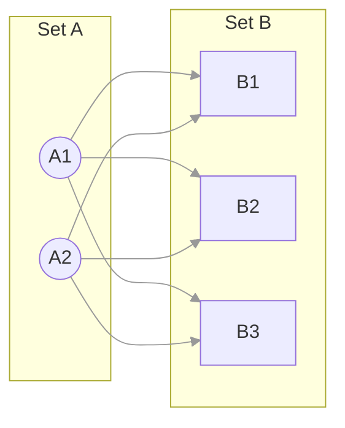

In this module, we will do the opposite of filtering. We are going to embrace **excess**. We will look at what happens when we stop trying to find specific relationships and instead decide that *everything* relates to *everything*.

Welcome to the **Cartesian Product**. In SQL, this is often the result of a typo. In Set Theory, it is the foundation of **all** relationships.

## 8.1 The Cross Product ($A \times B$)
Let's say you are packing for a trip. You are a minimalist, so you only pack two shirts and three pairs of pants.

**Set S (Shirts)**: `{Black Tee, White Button-Up}`

**Set P (Pants)**: `{Jeans, Chinos, Shorts}`

How many outfits do you actually have? Unless you are a fashion avant-gardist who wears two shirts at once, you pick one from column A and from column B.

- (Black Tee, Jeans)
- (Black Tee, Chinos)
- (Black Tee, Shorts)
- (White Button-Up, Jeans)
- (White Button-Up, Chinos)
- (White Button-Up, Shorts)

You have created a new set. This new set doesn't contain just shirts, and it doesn't contain just pants. It contains **pairs**.

### The Definition
The **Cartesian Product** (denoted $A \times B$) is the set of all possible ordered pairs (a, b) where a is a member of $A$ and b is a member of $B$.

$$
A \times B = \{(a, b) \mid a \in A \land b \in B\}
$$

It is named after Rene Descartes, the same guy who gave us the X, Y coordinate plane. And that is precisely what this is. If you put Set $A$ on the X-axis and Set $B$ on the Y-axis, the Cartesian Product is the grid of points where they meet.

### Why It's Called a "Product"
You might have noticed that in our outfit example, we had 2 shirts and 3 pants, and we ended up with 6 outfits.

$$
2 \times 3 = 6
$$

This is not a coincidence. The size (cardinality) of the resulting set is equal to the size of Set $A$ multiplied by the size of Set $B$.

$$
\lvert A \times B \rvert = \lvert A \rvert \cdot \lvert B \rvert
$$

This simple multiplication fact is one of the most important concepts in data engineering. It is the reason why your database server sometimes catches fire.

### Visualizing the All-to-All
In a diagram, the Cross Product looks like a tangled web. Every single node on the left must reach out and touch every single node on the right.



### The SQL Connection: `CROSS JOIN`
In the database world, this operation is known as the `CROSS JOIN`.

Most of the time, you don't write this explicitly. You usually want an `INNER JOIN` (where you match specific keys). But—and here is the secret—mathematically, **every join starts as a Cartesian Product**.

Conceptually, when you ask the database to join `Orders` and `Customers`, the logic starts by pairing every order with every customer (the Product), and *then* it filters down to the ones where the IDs match (the Predicate).

Modern query optimizers are smart enough to skip the "make everything" step, but the logic remains: **The Product is the raw material from which all other joins are carved**.

!!! example "The Menu Combo"

    Think of a fast-food menu.

    - **Main**: `{Burger, Chicken, Fish}` (3 items)
    - **Side**: `{Fries, Rings}` (2 items)
    - **Drink**: `{Soda, Water, Shake}` (3 items)

    If you want to know every possible "Combo Meal" that exists, you calculate the Cartesian Product of all three sets:

    $$
    M \times S \times D
    $$

    Total Combinations: $3 \times 2 \times 3 = 18$ distinct meals.


### Why Do We Use It?
If this just creates a mess of combinations, is it useful? Absolutely.

1. **Generating Calendars**: You have a list of `Employees` and a list of `Days` in the month. You would like to generate a blank timesheet for everyone. `Employees CROSS JOIN Days` gives you a row for every person for every day.
2. **Testing Edge Cases**: You have a list of `Inputs` and a list of `Settings`. You would like to test your software against every possible configuration.
3. **Grid Search**: In Machine Learning, you cross-reference different parameters to find the best model.

But there is a dark side to this power. In the next section, we are going to look at what happens when the numbers get big.

## 8.2 The Explosion Risk
In the last section, we made outfits. 2 shirts $\times$ 3 pants = 6 combinations. It was quaint. It was manageable. You could write the results on a sticky note.

But data engineering doesn't happen on sticky notes. It happens on servers handling millions of records. And this is where the simple multiplication of the Cartesian Product turns into a weapon of mass destruction for your database.

We call it the **Cartesian Explosion**.

### The Math of Disaster
Let's look at two relatively small tables in a corporate database.

- **Customers**: 50,000 rows (A mid-sized business).
- **Orders**: 1,000,000 rows (A decent year of sales).

These are not "Big Data." You could open these in Excel (mostly). But let's say a junior analyst wants to join them to see who bought what, and they make a tiny mistake. They accidentally trigger a Cross Product.

How many rows does the database try to generate?

$$
50,000 \times 1,000,000 = 50,000,000,000
$$

That is 50 billion rows.

IF each row is a modest 100 bytes of text, the result set is roughly **5 Terabytes** of data.

Your database server does not have 5 Terabytes of RAM. It probably doesn't have 5 Terabytes of fast scratch disk space. So, one of two things happens:

1. **The Slow Death**: The query runs for 14 hours, filling up the hard drive until other applications start crashing.
2. **The OOM Killer**: The operating system notices the database eating all the memory and unceremoniously shoots it in the head (Out of Memory Error).

### The "Comma" Trap
In the early days of SQL (and you will still see this in legacy code), people wrote joins using commas:

```sql
-- The "Old School" Join
SELECT *
FROM Customers, Orders
WHERE Customer.id = Orders.customer_id
```

This syntax is dangerous. The comma tells the database, "Calculate the Cartesian Product of Customers and Orders." The `WHERE` clause then tells it, "Okay, now throw away 99.99% of what you just built and keep the matches."

If you simply **forget** to highlight that `WHERE` line—maybe you commented it out for testing and forgot to uncomment it—you unleash the explosion.

!!! failure "The Accidental Cross Join"

    This is why modern data engineers prefer th explicit `INNER JOIN` syntax. If you write `FROM Customers INNER JOIN Orders` but forget the `ON` condition, the database will throw a syntax error and save you. It refuses to guess. It forces you to define the relationship.

### Complexity Theory ($O(N \cdot M)$)
For those of you studying computer science algorithms, the Cartesian Product is the physical manifestation of $O(N \cdot M)$ complexity.

- If Table A doubles in size, the work doubles.
- If Table B doubles in size, the work doubles.
- If **both** double, the work quadruples.

THis non-linear scaling is why we fear the cross product. It lurks in the shadows of every query plan, waiting for a missing join key to strike.

### When "Explosions" are Intentional
I don't want to make you afraid to ever use this. Sometimes, you need an explosion.

Imagine, you are building a report for a manufacturing plant. You need to know how many widgets are produced **every hour** of the day.

- Your `Production` table only has rows when things were actually made. If nothing was made at 3:00 AM, there is no row.
- But your boss wants to see "3:00 AM: 0".

To fix this, you take a `Hours` table (24 rows) and cross join it with your `ProductionLines` table (10 lines).

$$
24 \times 10 = 240
$$

This gives you a perfect "scaffold"—a grid of every line for every hour. You then left join your actual production data onto this scaffold.

The key difference? **240 rows** is manageable. **50 billion** is not.

### Safety First
The lesson here isn't "never cross join." The lesson is **respect the cardinality**. Before you join two sets, always ask yourself, *"How big is A? How big is B? What is A $\times$ B?"*

If the answer involves the word "Billion" and you didn't plan for it, stop typing.

## 8.3 Limiting the Product: The Birth of the Join
We are standing in front of a massive block of marble. This is our Cartesian Product. It contains every possible combination of data—the good, the bad, and the nonsensical.

To find the meaningful data inside this block, we need a chisel.

In set theory (and database logic), the chisel is called a **predicate**.

You might remember predicates from module 5. A predicate is just a fancy word for a function that returns `True` or `False`. When we apply a predicate to a Cartesian Product, we are effectively saying, *"Look at every pair in this massive grid. If the pair makes sense, keep it. If it doesn't, throw it away."*

This process—taking a product and filtering it by a predicate—is the mathematical definition of a **join**.

### The Join Formula
If you want to feel like a wizard, memorize this formula:

$$
A \bowtie B = \sigma_{criteria} (A \times B)
$$

Don't panic. Let's decode the Greek.

- $A \times B$ is the **Cartesian Product** (The block of marble).
- $\sigma$ (Sigma) is the **Selection/Filter** (The chisel).
- $\bowtie$ (The Bowtie) is the symbol for a **join** (The statue).

This tells us something profound: A join isn't a magical third operation. It is just a cross product that went on a diet.

### The "Equi-Join" (The Diagonal)
The most common chisel we use is the equals sign (=).

Let's go back to our tickets example.

- **Set P (People)**: `{Alice (ID: 1), Bob (ID: 2)}`
- **Set T (Tickets)**: `(Ticket #100 (Owner:1), Ticket #200 (Owner: 2))`

**Step 1: The Product (4 Pairs)**

1. (Alice, Ticket #100)
2. (Alice, Ticket #200)
3. (Bob, Ticket #100)
4. (Bob, Ticket #200)

**Step 2: The Predicate**

Our rule is `Person.ID == Ticket.Owner`.

1. (Alice, Ticket #100) $\to$ True (keep).
2. (Alice, Ticket #200) $\to$ False (discard).
3. (Bob, Ticket #100) $\to$ False (discard).
4. (Bob, Ticket #200) $\to$ True (keep).

We have carved away the noise and revealed the relationship.

### The "Theta-Join" (The Range)
Occasionally, the relationship isn't about equality. Occasionally, it's about *time* or *value*.

Imagine you have a table of **Events** and a table of **Fiscal Quarters**.

- **Events**: `{Sale on Jan 15th, Sale on Feb 20th}`
- **Quarters**: `{Q1 (Jan-Mar), Q2 (Apr-Jun)}`

How do you join these? There is no "ID" to match. You can't say `Date = Quarter`. Instead, you use a **Non-equi Join** (or Theta-join).

The predicate: `Event.Date BETWEEN Quarter.Start AND Quarter.End`.

The database still conceptually pairs every event with every quarter, but the "chisel" only keeps the pair where the date falls inside the bucket.

### Why Optimization Matters
I mentioned earlier that modern databases are smart. If you actually tried to build the full 50-billion-row Cross Product in memory *before* filtering it, your server would  melt.

Instead, database optimizers use advanced algorithms (Hash Joins, Merge Joins) to 'cheat.' They look at your chisel (the `ON` clause) first. They organize the data specifically so they can find the matches *without* building the failures.

But as a data engineer, it is vital to remember the underlying math. Why? Because if you write a predicate that is too complex—like `ON (A.Value + B.Value) > (A.Time / B.Time)`—the optimizer might get confused, throw up its hands, and revert to the brute-force method: building the product and filtering it one by one.

## Quiz

<quiz>
Mathematically, what is the Cartesian Product $(A \times B)$?
- [ ] The result of subtracting B from A.
- [ ] The set of all elements in A combined with all elements in B.
- [x] The set of all ordered pairs (a, b) where a is from A and b is from B.
- [ ] The set of all elements that are both A and B.

</quiz>

<quiz>
If Set A has 10 elements and Set B has 5 elements, what is the cardinality (size) of $A \times B$?
- [ ] 2
- [ ] 100
- [ ] 15
- [x] 50

</quiz>

<quiz>
Which SQL syntax is known as the 'Comma Trap' because it implicitly creates a Cartesian Product?
- [ ] `SELECT * FROM A INNER JOIN B ON A.id = B.id`
- [ ] `SELECT * FROM A LEFT JOIN B`
- [x] `SELECT * FROM A, B`
- [ ] `SELECT * FROM A UNION B`

</quiz>

<quiz>
In the context of database performance, what is the 'Cartesian Explosion'?
- [ ] When the database automatically deletes old data to make room for new joins.
- [ ] When a join produces significantly fewer rows than expected.
- [x] When the result set grows exponentially large (e.g., billions of rows) due to an unintended cross join.
- [ ] When a query returns an error because of a syntax mistake.

</quiz>

<quiz>
What is the computational complexity of a Cartesian Product between two sets of size N and M?
- [ ] $O(\log{N})$
- [x] $O(N \cdot M)$
- [ ] $O(1)$
- [ ] $O(N + M)$

</quiz>

<quiz>
According to the 'Join Formula' $A \bowtie B = \sigma (A \times B)$, what is the role of $\sigma$ (Sigma)?
- [ ] It represents the sorting order of the result.
- [ ] It represents the union of the two sets.
- [x] It represents the predicate (filter) that selects valid pairs from the product.
- [ ] It represents the sum of all values in the columns.

</quiz>

<quiz>
What is a "Theta-Join"?
- [ ] A join that returns 0 rows.
- [x] A join that uses inequalities (like $\lt$, $\gt$) or ranges (BETWEEN) as the predicate.
- [ ] A join that connects a table to itself.
- [ ] A join that only uses the equals sign (=)

</quiz>

<quiz>
Which of the following is a valid, intentional use case for a Cartesian Product?
- [x] Generating a 'scaffold' of all possible combinations (e.g., every employee for every day of the month).
- [ ] Finding the average sales price.
- [ ] Filtering duplicates out of a list of customer names.
- [ ] Ensuring data integrity by removing orphans.

</quiz>

<quiz>
If you perform an INNER JOIN but forget to write the `ON` clause in some older SQL dialects, what happens?
- [ ] The database returns an empty set.
- [ ] It performs a left join by default.
- [x] The database defaults to a Cartesian Product.
- [ ] The database automatically guesses the correct ID to join on.

</quiz>

<quiz>
Why is the Cartesian Product describes as the 'raw material' of all joins?
- [ ] Because it is the only join type supported by early computers.
- [x] Because conceptually, you start with all possibilities and then filter down to the correct ones.
- [ ] Because it removes NULL values automatically.
- [ ] Because it is the fastest way to join data.

</quiz>


<!-- mkdocs-quiz results -->