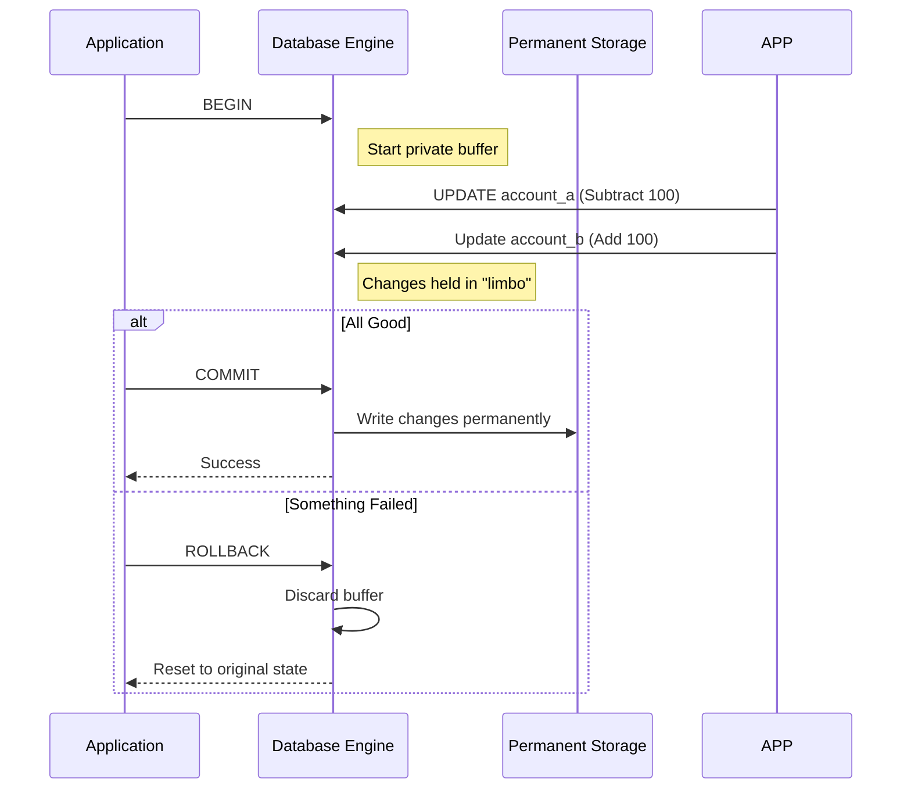

In the previous chapters, we treated every SQL statement as an isolated island. You run a `DELETE`, the row vanishes. You run an `UPDATE`, the value changes. But the real world is rarely that tidy. Real-world operations usually involve a series of steps that must succeed or fail as a single unit.

Imagine you are transferring $100 from your savings account to your checking account. That's two steps:

1. Subtract $100 from savings.
2. Add $100 to checking.

If the power goes out after step one but before step two, that $100 doesn't just leave your savings; it leaves existence. That is a bug that gets people fired. **Transactions** are our way of telling the database, "Treat this entire block of work as one inseparable heartbeat."

## 11.1 ACID Properties
To ensure our data doesn't end up in digital purgatory, database systems adhere to the **ACID** acronym. It's the gold standard for reliability. 

- **Atomicity**: The "All or nothing" rule. If one part of the transaction fails, the whole thing is undone.
- **Consistency**: The database starts in a valid state and ends in a valid state, respecting all constraints (like `NOT NULL` or `FOREIGN KEY`).
- **Isolation**: Transactions happening at the same time shouldn't trip over each other.
- **Durability**: Once the database says a transaction is finished, the data is saved to permanent storage. Even if the server crashes five seconds later, the data is safe.

!!! abstract "The Ledger Analogy"

    Think of a transaction like writing in a pencil ledger. You can write several lines, erase them, and change your mind. But once you trace over them in permanent ink (Commit), they are there forever.

## 11.2 Transaction Isolation Levels
Isolation is the trickiest part of ACID. Perfect isolation (making everyone wait their turn) is slow. No isolation (letting everyone touch everything) is chaotic. SQL gives us four levels of compromise:

| Isolation Level | Dirty Reads | Non-Repeatable Reads | Phantom Reads |
|:---|:---|:---|:---|
| Read Uncommitted | Possible | Possible | Possible |
| Read Committed | No | Possible | Possible |
| Repeatable Read | No | No | Possible |
| Serializable | No | No | No |

### The "Read Phenomena" Explained

 - **Dirty Reads**: You read data that another transaction has changed but hasn't "finalized" yet. If they undo their changes, your data is now a lie.
 - **Non-Repeatable Read**: You read a row, someone else updates it, and you read it again (getting a different value).
 - **Phantom Read**: You query a range (e.g., "all users in NY"), someone else inserts a new user, and your second query finds a "phantom" row that wasn't there before.

## 11.3 Transaction Commands
In most SQL environments, "Autocommit" is turned on by default. To take the wheel yourself, you need these four commands.

### BEGIN (or START TRANSACTION)
This tells the database to stop treating every line as a final decision. You are now in a "drafting" state

```sql
BEGIN;
-- Everything from here on is temporary until we say otherwise.
```

### COMMIT
This is the "Save" button, it pushes all your pending changes into the database's permanent history.

```sql
BEGIN;
UPDATE accounts SET balance = balance - 100 WHERE id = 1;
UPDATE accounts SET balance = balance + 100 WHERE id = 2;
COMMIT;  -- Now the money has officially moved.
```

### ROLLBACK
The "panic" button. This wipes away everything you've done since the last `BEGIN`.

```sql
BEGIN;
DELETE FROM users; -- "Wait, I forgot the WHERE clause!"
ROLLBACK;          -- "Phew. Everyone is back."
```

### SAVEPOINT
Sometimes you don't want to undo *everything*. A `SAVEPOINT` is like a checkpoint in a video game.

```sql
BEGIN;
INSERT INTO orders (item, price) VALUES ('Sword', 50);
SAVEPOINT post_sword;

INSERT INTO orders (item, price) VALUES ('Shield', 100);
-- Oops, I don't have enough gold for the shield!
ROLLBACK TO SAVEPOINT post_sword;

COMMIT; -- Only the sword is saved.
```

### Visualizing the Flow



!!! warning "Long-Running Transactions"

    Avoid keeping a transaction open while waiting for user input (like a pop-up window). While a transaction is open, the database often holds "locks" on rows or tables. If you go to lunch with an open transaction, you might freeze the entire database for everyone else!

## Quiz

<quiz>
Which property of ACID ensures that a transaction is treated as a single "all or nothing" unit?
- [ ] Consistency
- [x] Atomicity
- [ ] Isolation
- [ ] Durability

</quiz>

<quiz>
The `ROLLBACK` command can be used to undo a transaction even after a `COMMIT` has been successfully executed.
- [ ] True
- [x] False

A `ROLLBACK` only affects pending changes in the current transaction block; once committed, data is written to permanent storage.
</quiz>

<quiz>
Which isolation level completely prevents Dirty Reads, Non-Repeatable Reads, and Phantom Reads?
- [ ] Repeatable Read
- [ ] Read Uncommitted
- [x] Serializable
- [ ] Read Committed

</quiz>

<quiz>
What occurs during a "Dirty Read"?
- [ ] A transaction reads the same row twice and gets different data because of an update.
- [ ] A transaction fails to write data because the disk is full.
- [ ] A transaction sees new rows added by another transaction during a range query.
- [x] A transaction reads data that has been changed by another transaction but not yet committed.

</quiz>

<quiz>
You are writing a script and want to create a checkpoint so you can undo only the last few steps if an error occurs. Which command should you use?
- [x] `SAVEPOINT`
- [ ] `COMMIT`
- [ ] `ROLLBACK TO START`
- [ ] `BEGIN`

</quiz>

<quiz>
If a database server crashes immediately after a `COMMIT` command is confirmed, which ACID property ensures the data is still there when the serve restarts?
- [ ] Atomicity
- [ ] Consistency
- [x] Durability
- [ ] Isolation

</quiz>

<quiz>
Which command is used to start a new transaction block in most SQL dialects?
- [ ] `OPEN`
- [ ] `START`
- [ ] `INIT`
- [x] `BEGIN`

</quiz>

<quiz>
In the context of isolation levels, what is a "Phantom Read"?
- [ ] When a transaction reads uncommitted data that is later rolled back.
- [ ] When a transaction cannot read a row because it is locked.
- [ ] When a row you just updated disappears.
- [x] When a re-executed query returns a different set of rows because another transaction inserted new ones.

</quiz>

<quiz>
Which of the following describes the 'Consistency' property in ACID?
- [ ] Data is never lost once the user receives a success message.
- [ ] All steps of a transaction must succeed for any to be saved.
- [ ] Multiple transactions can run at the same time without interfering.
- [x] The database must always be in a valid state, following all constraints and triggers.

</quiz>

<!-- mkdocs-quiz results -->

## Summary
This chapter covered the essential "safety net" of database management: **Transactions**. It explored how to group multiple SQl operations into a single, reliable unit of work to ensure data integrity.

## Lab
Please complete Chapter 11 labs from the companion [GitHub Repository](https://github.com/mckenzie-andrew/odea-labs){target="_blank"}. 