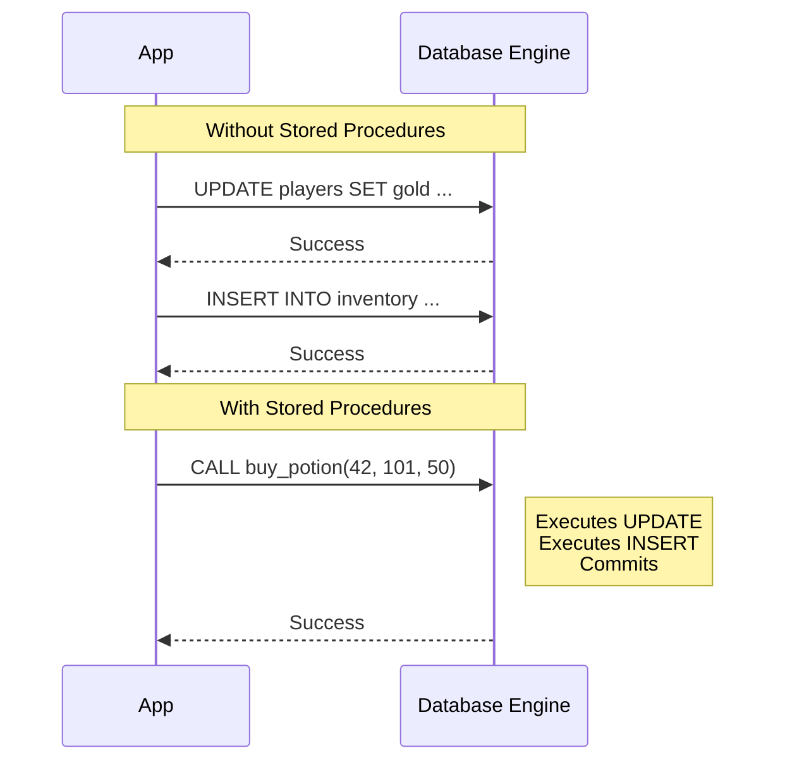
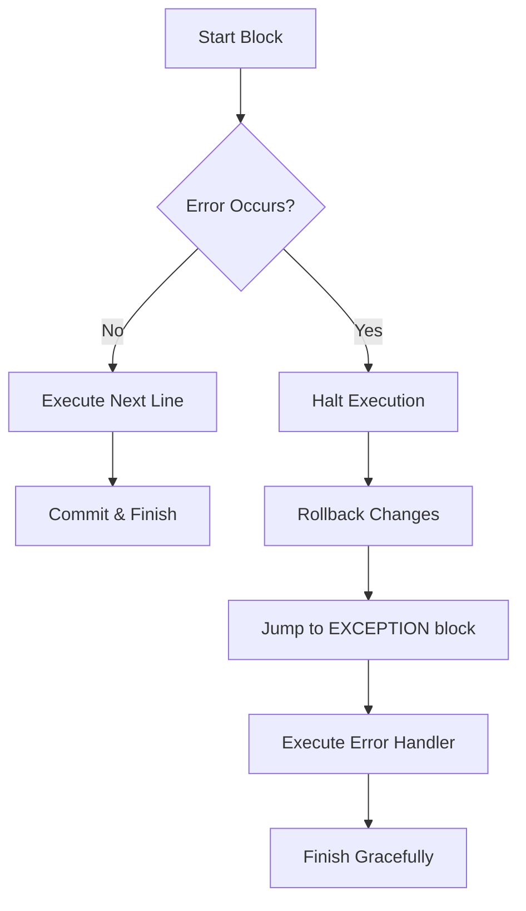

Up until now, our relationship with the database has been strictly transactional (in the literal sense). We ask for data (`SELECT`), we insert data (`INSERT`), or we change it (`UPDATE`). It's a call-and-response rhythm. We send a query, the database engine figures out the best way to execute it, and it hands us back the result set. This is the beauty of **declarative** programming: you describe *what* you want, not *how* to get it.

But sometimes, "what you want" isn't a single set of rows. Sometimes you want to encapsulate complex logic, automate a sequence of events, or enforce rules that are too knotty for a simple `CHECK` constraint. You want to move logic *into* the database, right next to the data it manipulates.

To do that, we need to cross the bridge from declarative SQL into the imperative world. We are entering the domain of **Procedural SQL**.

## 12.1 Procedural SQL
If standard SQL is a shopping list ("I need eggs, milk, and bread"), Procedural SQL is the recipe ("Crack the eggs, whisk them, dip the bread...").

Most major databases engines wrap standard SQL in their own procedural extension. Oracle has PL/SQL, Microsoft has T-SQL, and PostgreSQL has PL/pgSQL. While the syntax varies enough to be annoying, the core concepts are universal. We are going to introduce variables, conditional logic, loops, and error handling (the bread and butter of programming), directly into our database queries.

!!! abstract "The 'Black Box'"

    In software engineering, we love black boxes. We love inputs that enter a box and produce outputs without us needing to care about the messy wiring inside. Procedural SQL allows us to treat the database less like a filing cabinet and more like an API.

By the end of this chapter, you won't just be writing queries; you'll be writing *programs* that live inside your database server.

## 12.2 Stored Procedures
Let's start with the heavy lifter: the **stored procedure**.

Think of a stored procedure as a script that you save inside the database. It can take input parameters, perform multiple actions (like modifying several tables at once), and even return results. It is the closest thing SQL has to a `void` function in C or a method in Java.

### The Anatomy of a Procedure
A procedure is defined by a name, a set of parameters, and a body of code. Let's look at a scenario. We are running an RPG game database. When a player buys a potion, we need to do two things transactionally:

1. Deduct gold from the player's wallet.
2. Add the potion to their inventory.

If we did this in our application code, we'd have to send two separate queries. If the network crashes between them, the player might lose gold without getting their potion. A stored procedure handles this atomically.

Here is what that looks like in a Postgres-flavored syntax:

```sql
CREATE PROCEDURE buy_potion(
    player_id INT,
    potion_id INT,
    cost INT
)
LANGUAGE plpgsql
AS $$
BEGIN

    -- 1. Deduct Gold
    UPDATE players
    SET gold = gold - cost
    WHERE id = player_id;

    -- 2. Add potion
    INSERT INTO inventory (player_id, item_id, quantity)
    VALUES (player_id, potion_id, 1);

    -- We can even commit the transaction right here!
    COMMIT;
END;
$$
```

To run this, we don't `SELECT` it. We `CALL` it:

```sql
CALL buy_potion(42, 101, 50);
```

### Why Bother?
You might ask, "Why not just write this logic in my Python or Java backend?" You certainly can. But stored procedures offer a specific benefit: **traffic reduction**.

Instead of sending multiple hefty queries back and forth over the network, you send one tiny command: `CALL`. The database engine, which is already holding the data in memory, executes the logic locally. It is blazingly fast.



!!! warning "The Logic Trap"

    It is very tempting to move *all* your business logic into stored procedures. **Resist this urge**. Database languages are clunky to debug, hard to version control, and difficult to test compared to modern application languages. Use stored procedures for data-heavy, atomic operations. DO not use them to validate email addresses or render HTML.

## 12.3 User-Defined Functions (UDFs)
If a stored procedure is a *command*, a **User-Defined Function (UDF)** is a *calculation*.

The primary distinction is intent:

- **Procedures** are for **doing things** (`INSERT`, `UPDATE`, `DELETE`).
- **Functions** are for **computing values** (returning data).

SQL already comes with built-in functions like `UPPER()`, `COUNT()`, `SUBSTRING()`. UDFs allow you to build your own.

### Scalar Functions
A scalar function takes input and return sa single value. Imagine we constantly need to calculate the "Level" of a player based on their experience points (XP). We don't want ot copy-paste that math into every `SELECT` statement.

```sql
CREATE FUNCTION get_level(xp INT)
RETURNS INT
LANGUAGE plpgsql
AS $$
BEGIN
    RETURN FLOOR(SQRT(xp) * 0.1);
END;
$$;
```

Now, our queries become readable and elegant:

```sql
SELECT username, get_level(experience_points)
FROM players;
```

### Table-Valued Functions
Sometimes, you want a function to return rows, acting like a parameterized view. This is a **Table-Valued** function.

Imagine we want to fetch all "high value" players in a specific guild.

```sql
CREATE FUNCTION get_high_rollers(guild_id INT)
RETURNS TABLE(username TEXT, gold INT)
AS $$
BEGIN
    RETURN QUERY
    SELECT p.username, p.gold
    FROM players AS p
    WHERE p.guild_id = get_high_rollers.guild_id
    AND p.gold > 10000;
END;
$$ LANGUAGE plpgsql;
```

You can treat this function exactly like a table in your `FROM` clause:

```sql
SELECT * FROM get_high_rollers(5);
```

### Visualization: The Execution Content
Imagine a factory conveyor belt (the Query Executor). When it sees a standard column like `gold`, it just grabs the box. When it sees a function call like `get_level(xp)`, it has to pause the main belt, take the `xp` value, run over to a separate workbench (the function logic), calculate the result, run back, and place the result on the belt. This happens for **every single row**. If your table has millions of rows, you are running to that workbench millions of times.

!!! note "Performance Killer"

    The visualization above highlights a major risk. Scalar functions in a `WHERE` or `SELECT` clause run once for every row processed. If your function executes a query inside it (e.g., looking up a value in another table), you have just created a massive performance bottleneck known as "Row-by-Row Agonizing Processing" (RBAR). Keep functions lightweight.

## 12.4 Control-of-Flow Logic
We have the containers (Procedures and Functions), but we need the logic to fill them. This is where SQL starts to look like code.

### Variables
First, we need a place to store temporary values.

```sql
DECLARE
    player_count INT;
    average_gold DECIMAL(10, 2);
BEGIN
    -- Assigning values
    player_count := 10;

    -- Storing query results into variables
    SELECT AVG(gold) INTO average_gold FROM players;
END;
```

### IF / ELSE
Branching logic allows our database to make decisions.

```sql
IF average_gold < 100 THEN
    RAISE NOTICE 'Economy is crashing!';
ELSIF average_gold > 10000 THEN
    RAISE NOTICE 'Inflation is rampant!';
ELSE
    RAISE NOTICE 'Economy is stable.';
END IF;
```

### Loops
Loops are rare in SQL because we usually prefer set-based operations (processing all rows at once). However, sometimes you need to iterate, usually when dealing with cursors or complex administrative tasks.

```sql
WHILE player_count > 0 LOOP
    -- Do something repetitive
    player_count := player_count - 1;
END LOOP;
```

### Putting it Together: The "Soft Delete" Logic
Let's combine `IF` logic with stored procedures. A common pattern in a database design is the "Soft Delete" (we never actually `DELETE` data, we just mark it as deleted so we can recover it later).

We can write a procedure that handles this intelligently:

```sql
CREATE PROCEDURE safe_delete_player(target_id INT)
LANGUAGE plpgsql
AS $$
DECLARE
    is_active BOOLEAN;
BEGIN
    -- Check if player exists and is active
    SELECT active INTO is_active FROM players WHERE id = target_id;

    IF is_active IS NULL THEN
        RAISE EXCEPTION 'Player % not found!', target_id;
    END IF;

    IF is_active = FALSE THEN
        RAISE NOTICE 'Player % is already deleted.', target_id;
    ELSE
        -- Perform the soft delete
        UPDATE players
        SET active = FALSE, deleted_at = NOW()
        WHERE id = target_id;

        RAISE NOTICE 'Player % has been soft-deleted.', target_id;
    END IF
END;
$$;
```

This is the power of Procedural SQL. We aren't just moving data; we are enforcing business rules, handling errors gracefully, and providing feedback, all within a single atomic call.

## 12.5 Error Handling
By now you have seen a few keywords that have not been introduced, mainly: `RAISE NOTICE ... `. If you have written any code before, you know that software is fragile. Inputs are wrong, constraints are violated, and sometimes, the logic just plain fails. If we don't handle these failures, the database engine will handle them for us (usually by aborting everything and sending a cryptic error code to the user).

In Procedural SQL, we don't just let the program crash. We anticipate the crash.

### Raising Voices
First, let's look at how to trigger an error manually. You saw this in the previous section with `RAISE EXCEPTION`. This is how your procedure shouts, "Stop! Something went wrong!"

In PostgreSQL (PL/pgSQL), the `RAISE` statement is your primary tool. It accepts a "severity level" which determines if the execution stops or just leaves a log entry.

 - `NOTICE`: "Just so you know." (Writes to the log/console, execution continues).
 - `WARNING`: "This looks bad, but i'm keeping going."
 - `EXCEPTION`: "ABORT!" (Stops execution, rolls back the transaction).

```sql
-- This just prints to the console
RAISE NOTICE 'The potion count is low: % remaining', current_quantity;

-- This kills the process immediately
RAISE EXCEPTION 'Player cannot carry any more items!';
```

### Trapping Errors
Raising an error is easy. Catching is where the elegance lies.

In high-level languages like Java or Python, you use `try/catch`. In PL/pgSQL, we use the `EXCEPTION` block located at the very bottom of our `BEGIN...END` structure.

When an error occurs anywhere in the `BEGIN` block, the flow of execution immediately jumps to the `EXCEPTION` block. If no error occurs, that block is skipped entirely. 

!!! abstract "The Safety Net"

    Think of the `EXCEPTION` block as a safety net underneath a trapeze artist. If the artist (your code) completes the routine, they bow and leave. If they slip (an error), they fall into the net. The net catches them, allows them to stand up, and maybe log what went wrong before exiting gracefully.

### The Syntax in Action
Let's look at a transaction that might fail. We want to attempt to transfer gold between players. If the sender doesn't have enough gold, the database constraint will trigger an error. We want to catch that specific error and handle it cleanly.

```sql
CREATE PROCEDURE transfer_gold(sender_id INT, receiver_id INT, amount INT)
LANGuAGE plpgsql
AS $$
BEGIN
    -- Attempt the transfer
    -- If this causes gold to go negative (violating a check constraint),
    -- it throws an error immediately.
    UPDATE players SET gold = gold - amount WHERE id = sender_id;
    UPDATE players SET gold = gold + amount WHERE id = receiver_id;

    -- If we get here, it worked
    RAISE NOTICE 'Transfer successful.';

EXCEPTION
    -- This block only runs if something above failed
    WHEN check_violation THEN
        -- Handle the specific case where a CHECK constraint failed
        RAISE NOTICE 'Transfer failed: Insufficient funds for Player %', sender_id;
        -- We don't need to ROLLBACK manually; entering this block
        -- automatically rolls back the steps in the main BEGIN block.
    
    WHEN OTHERS THEN
        -- Catch-all for any other weird errors
        RAISE NOTICE 'An unknown error occurred.';
END;
$$;
```

### Visualizing the Jump
It is important to visualize how the "cursor" of execution moves during an error. It does not step over the error; it teleports.



!!! warning "The Swallow"

    Be very careful with `WHEN OTHERS THEN`. If you catch *every* error and just print a message like "Something went wrong," you are **swallowing the error**. The calling application will think the transaction succeeded because the procedure finished without crashing. Generally, you want to fix the data if you can, or re-raise the error so the app knows it failed.

## Quiz

<quiz>
According to the chapter, what is the fundamental difference between Standard SQL and Procedural SQL?
- [x] Standard SQL is declarative (what to do), while Procedural SQL is imperative (how to do it).
- [ ] Standard SQL executes on the server, while Procedural SQL executes on the client application.
- [ ] Standard SQL is imperative (how to do it), while Procedural SQL is declarative (what to do).
- [ ] Standard SQL cannot return data, while Procedural SQL can.

</quiz>

<quiz>
Which SQL command is predominantly used to execute a Stored Procedure?
- [x] `CALL`
- [ ] `SELECT`
- [ ] `RUN`
- [ ] `EXECUTE_SCRIPT`

</quiz>

<quiz>
Stored Procedures are the best tool for simple calculations, such as formatting a date or doing  math on a column.
- [ ] True
- [x] False

</quiz>

<quiz>
What is the primary risk of using a complex Scalar Function inside a `SELECT` or `WHERE` clause?
- [ ] It automatically commits the transaction before the query finishes.
- [ ] It causes a deadlock in the database.
- [x] It triggers a 'Row-by-Row Agonizing Processing' (RBAR), causing the function to run once for every single row.
- [ ] It creates a duplicate table in the database storage.

</quiz>

<quiz>
Which of the following scenarios is the best use case for a Stored Procedure?
- [ ] Validating an email address format.
- [ ] Rendering an HTML page for a report.
- [x] Atomically deducing currency from one user and adding an item to another table.
- [ ] Capitalizing the first letter of a username in a `SELECT` query.

</quiz>

<quiz>
In the context of Stored Procedures, what is the main benefit of 'Traffic Reduction'?
- [ ] It prevents the application from sending any queries at all.
- [ ] It allows the database to delete old l ogs automatically.
- [x] It replaces multiple network round-trips with a single command sent to the server.
- [ ] It reduces the number of rows stored in the tables.

</quiz>

<quiz>
When an error occurs in a PL/pgSQL block, where does the flow of execution go?
- [ ] It skips the current line and continues to the next line.
- [x] It immediately jumps to the `EXCEPTION` block.
- [ ] It restarts the procedure from the beginning.
- [ ] It pauses and waits for user input.

</quiz>

<quiz>
What is the difference between `RAISE NOTICE` and `RAISE EXCEPTION`?
- [ ] `RAISE NOTICE` is used for syntax errors; `RAISE EXCEPTION` is for logic errors.
- [ ] `RAISE EXCEPTION` logs a message and continues; `RAISE NOTICE` halts execution.
- [x] `RAISE NOTICE` logs a message and continues; `RAISE EXCEPTION` halts execution and rolls back.
- [ ] There is no difference; they are synonyms.

</quiz>

<quiz>
What happens if you use `WHEN OTHERS THEN` to catch errors but simply print a message without re-raising the error?
- [x] You "swallow" the error, making the calling application think the transaction succeeded when it actually failed.
- [ ] The transaction is committed, bu the specific row causing the error is deleted.
- [ ] It causes the database engine to crash.
- [ ] THe database automatically fixes the data.

</quiz>

<quiz>
In the variable assignment example `player_count := 10;`, what is the purpose of the `:=` operator?
- [ ] It creates a constant that cannot be changed.
- [ ] It compares if `player_count` is equal to 10.
- [ ] It declares a new variable named `player_count`.
- [x] It assigns the value 10 to the variable `player_count`.

</quiz>

<!-- mkdocs-quiz results -->

## Summary
In this chapter, we stepped beyond the declarative nature of standard SQL and entered the imperative world of **Procedural SQL**. We explored how to encapsulate business logic using **stored procedures** for atomic transactions and **user-defined functions** for reusable calculations. We fill these constraints with standard programming constructs (variables, loops, and conditional branching) and secured them with robust **error handling** to manage the inevitable failures of complex systems.

## Lab
Please complete Chapter 12 labs from the companion [GitHub Repository](https://github.com/mckenzie-andrew/odea-labs){target="_blank"}. 