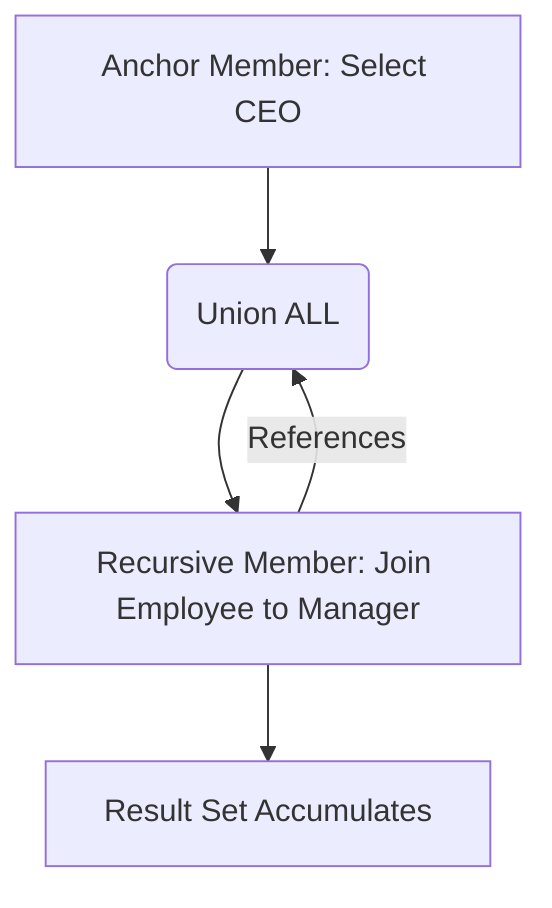

We have been treating our tables like simple collections of rows. We filter them, we join them, and we squash them together with aggregations. But SQL is capable of much more sophisticated gymnastics.

In this chapter, we are going to break the rigid "set-based" thinking just enough to perform sequential analysis, traverse hierarchical trees, and even write code that writes itself.

## 13.1 Window Functions
If `GROUP BY` is a sledgehammer that crushes rows into a single summary. **Window functions** are a pair fo tweezers. They allow you to look at a "window" of rows relative to the current row without collapsing them. You keep your detail rows, but you gain context.

The syntax relies on the clause `oVER`. Think of `OVER` as defining the scope of the tweezers.

### The Syntax Anatomy
```sql
Function_name() OVER (PARTITION BY ... ORDER BY ...)
```

- **PARTITION BY**: Breaks the data into buckets (like `GROUP BY` but without hiding rows).
- **ORDER BY**: Defines the sequence within that bucket.

Let's demonstrate a full example.

### `ROW_NUMBER`
This is the "hello world" of window functions. It simply assigns a sequential integer to each row within a partition.

```sql
SELECT
    athlete_name,
    sport,
    score,
    ROW_NUMBER() OVER (PARTITION BY sport ORDER BY score DESC) AS ranking
FROM olympics;
```

If you have three swimmers and two runners, the counter resets when the `sport` changes.

### `RANK` vs. `DENSE_RANK`
`ROW_NUMBER` is non-deterministic with ties (someone has to be first). `RANK` and `DENSE_RANK` handle ties with specific rules.

- **RANK**: Skips numbers after a tie. (1, 2, 2, 4).
- **DENSE_RANK**: Does not skip numbers (1, 2, 2, 3).

!!! note

    Think of `RANK` like the olympics. If two people get Gold (1st), nobody gets Silver (2nd); the next person gets Bronze (3rd). `DENSE_RANK` is more like a video game leaderboard; if two people tie for first, the next person is simply 2nd.


### `LEAD` and `LAG`
These functions allow you to time travel. You can access data from the *next* row (`LEAD`) or the *previous* row (`LAG`) without a complex self-join. This is vital for calculating Year-Over-Year growth or deltas.

```sql
SELECT
    month,
    revenue,
    LAG(revenue) OVER (ORDER BY month) AS previous_month_revenue,
    revenue - LAG(revenue) OVER (ORDER BY month) AS monthly_change
FROM monthly_sales;
```

## 13.2 Recursive Queries
Sometimes data isn't a list; it's a tree. Employees have managers, who have managers. Comments have replies, which have replies. Standard SQL struggles with this depth because we don't know how deep the tree goes.

Enter teh **Recursive CTE (Common Table Expression)**.

A recursive query has two parts, glued together by a `UNION ALL`:

1. **The Anchor Member**: The starting point (e.g., the CEO, the root folder).
2. **The Recursive Member**: A query that references the CTE itself to find the "next layer."



### Example: The Org Chart

```sql
WITH RECURSIVE OrgChart AS (
    -- 1. Anchor: Start with the boss
    SELECT employee_id, name, manager_id, 1 AS level
    FROm employees
    WHERE manager_id IS NULL

    UNION ALL

    -- 2. Recursion: Find people managed by the previous level
    SELECT e.employee_id, e.name, e.manager_id, o.level + 1
    FROM employees AS e
    INNER JOIN OrgChart AS o ON e.manager_id = o.employee_id
)
SELECT * FROM OrgChart;
```

!!! warning 

    Always ensure your recursion has a termination condition! If your data has a loop (A manages B, B manages A), this query will run until your database server creates a black hole or crashes (usually just a stack overflow error).

## 13.3 Pivot / Unpivot Operations
Business analysts love spreadsheets. They love seeing months as columns (`Jan`, `Feb`, `Mar`) rather than rows. In the database, adding columns dynamically is an anti-pattern, but displaying them that way is a common requirement.

### Pivoting (Rows to Columns)
While some SQL dialects (like T-SQL) have a `PIVOT` operator, the universal way to build this is using **Conditional Aggregation**. It reveals exactly what the engine is doing.

We want ot turn this:

| Year | Quarter | Revenue |
|:---|:---|:---|
| 2023 | Q1 | 100 |
| 2023 | Q2 | 150 |

Into this:

| Year | Q1 | Q2 |
|:---|:---|:---|
| 2023 | 100 | 150 |

### The Code:

```sql
SELECT
    Year,
    SUM(CASE WHEN Quarter = 'Q1' THEN Revenue ELSE 0 END) AS Q1,
    SUM(CASE WHEN Quarter = 'Q2' THEN Revenue ELSE 0 END) AS Q2,
    SUM(CASE WHEN Quarter = 'Q3' THEN Revenue ELSE 0 END) AS Q3,
    SUM(CASE WHEN Quarter = 'Q4' THEN Revenue ELSE 0 END) AS Q4
FROM Sales
GROUP BY Year;
```

### Unpivoting (Columns to Rows)
Unpivoting is the reverse: taking a wide spreadsheet and normalizing it into a tall table. We usually achieve this using `UNION ALL`.

```sql
SELECT 
    Year,
    'Q1' AS Quarter,
    Q1 AS Revenue
FROM WideSales;

UNION ALL

SELECT
    Year,
    'Q2' AS Quarter,
    Q2 AS Revenue
FROM WideSales;

-- Continue repeating for Q3 and Q4.
```

## 13.4 Common Table Expressions (CTEs)
We briefly touched on CTEs in the recursive section, but they deserve their own spotlight. A CTE is a temporary, named result set.

Think of a CTE as a **referencing tool**. It allows you to break a massive, nested "Spaghetti SQL" query into readable, logical chunks.

**The "Subquery from Hell"**:
```sql
SELECT * FROM (
    SELECT * FROM (
        SELECT ... -- deeply nested logic
    ) AS x WHERE ...
) AS y WHERE ...
```

**The "CTE Cleanup"**:
```sql
WITH RawSales AS (
    SELECT ... FROM Sales
),
CleanedSales AS (
    SELECT ... FROM RawSales WHERE amount > 0
)
SELECT * FROM CleanedSales;
```

!!! abstract

    CTEs are syntactical sugar. To the database optimizer; they are usually treated exactly the same as a subquery or a temp table. We use them for *human* readability, not necessarily for machine performance.

## 13.5 Dynamic SQL
We have arrived at the most dangerous tool in the box.

Standard SQL is static. You write `SELECT * FROM Users`. But what if you don't know the table name until runtime? What if the user selects which columns they want ot see via a checkbox on a website?

**Dynamic SQL** is the act of constructing a SQL string programmatically and then forcing the database to execute that string.

### Example (T-SQL Syntax)

```sql
DECLARE @tableName NVARCHAR(128) = 'Employees';
DECLARE @sql NVARCHAR(MAX);

SET @sql = 'SELECT * FROM ' + @tableName;

-- execute the string as code
EXEC sp_executesql @sql;
```

### The Great Danger: SQL Injection
When you concatenate strings to build code, you invite chaos.

If a hacker inputs the table name as: `Employees; DROP TABLE Orders; --`

Your dynamic SQL becomes: `SELECT * FROM Employees; DROP TABLE Orders; --`

The database will dutifully fetch the employees, and then immediately delete your orders table.

!!! warning

    Avoid Dynamic SQL whenever possible. If you must use it (for flexible searching or reporting tools), **never** concatenate user input directly into the string. Always use parameterized execution (like `sp_executesql` with parameters) to treat the input as data, not code.

## Quiz

<quiz>
In a Window Function, what is the primary role of the `PARTITION BY` clause?
- [ ] It physically splits the table into separate tables in the database storage.
- [ ] It collapses multiple rows into a single summary row, similar to `GROUP BY`.
- [x] It defines the scope or "bucket" of rows within which the window function operates.
- [ ] It determines the sort order of the rows within the window function.

</quiz>

<quiz>
Given a list of scores: 100, 90, 90, 80. Which ranking function would assign the ranks 1, 2, 2, 3?
- [ ] `RANK()`
- [ ] `ROW_NUMBER()`
- [ ] `LEAD()`
- [x] `DENSE_RANK()`

</quiz>

<quiz>
Window functions eliminate detail rows from the result set, making it impossible to see individual record data alongside the calculation.
- [ ] True
- [x] False

</quiz>

<quiz>
Which SQL operator is strictly required to combine the "Anchor Member" and the "Recursive Member" in a Recursive CTE?
- [ ] `MERGE`
- [x] `UNION ALL`
- [ ] `JOIN`
- [ ] `INTERSECT`

</quiz>

<quiz>
In a standard SQL environment (without specific `PIVOT` operators), what is the most common technique to pivot rows to columns?
- [ ] The `UNPIVOT` command.
- [ ] Recursive CTEs.
- [ ] Using a self-join for every column required.
- [x] Conditional Aggregation (SUM + CASE WHEN)

</quiz>

<quiz>
What is the primary security risk associated with using Dynamic SQL?
- [ ] Deadlocks
- [ ] Stack Overflow
- [ ] Data Redundancy
- [x] SQL Injection

</quiz>

<quiz>
Which Window Function would you use to compare a row's current value with the value of the *previous* row in the same result set?
- [x] `LAG()`
- [ ] `FIRST_VALUE()`
- [ ] `RANK()`
- [ ] `LEAD()`

</quiz>

<quiz>
What is a primary benefit of using a Common Table Expression (CTE) over a nested subquery?
- [ ] CTEs can be reused across different sessions and connections.
- [x] CTEs improve code readability and maintainability.
- [ ] CTEs are always faster than subqueries.
- [ ] CTEs allow you to modify data in the underlying table directly.

</quiz>

<quiz>
A Recursive CTE will inherently stop itself once it processes all rows in a table, even if the data contains a cycle (e.g., A manages B, B manages A).
- [ ] True
- [x] False

</quiz>

<quiz>
When "Unpivoting" a wide table (columns `Jan`, `Feb`, `Mar`) into a tall table (rows), which set operator is typically used?
- [ ] `EXCEPT`
- [ ] `JOIN`
- [x] `UNION ALL`
- [ ] `GROUP BY`

</quiz>

<!-- mkdocs-quiz results -->


## Lab
