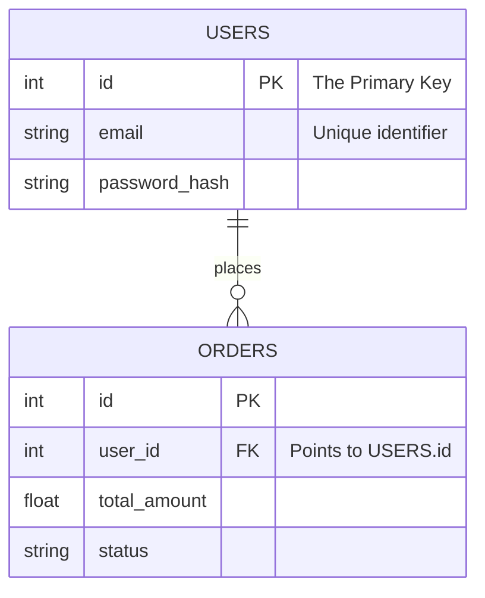
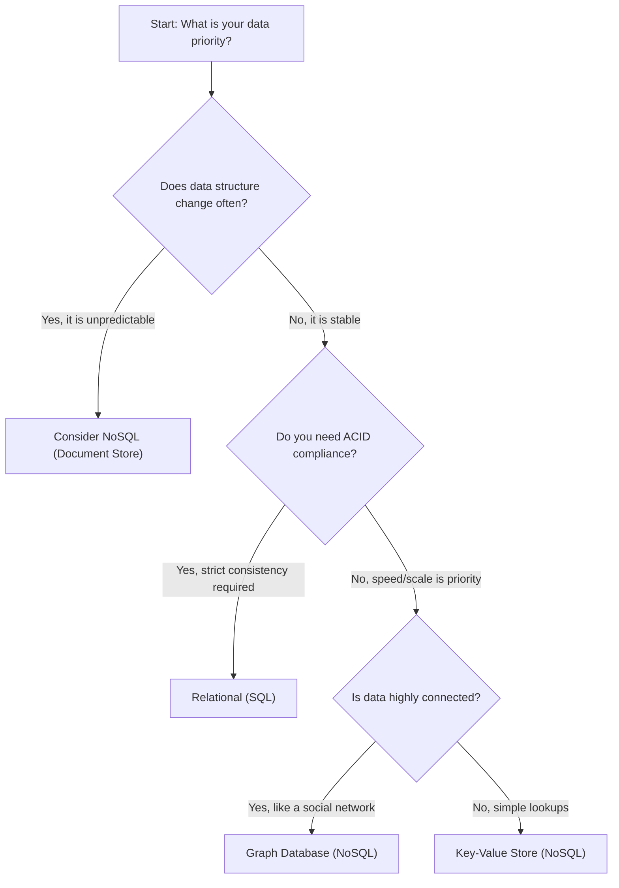

Welcome to the ground floor; before we can start slinging queries or optimizing indices, we need to agree on what exactly we are talking about. You might think you know what a database is - a black box where data goes in and (hopefully) comes back out - but the details of *how* it structures that defines everything about your application's architecture. 

We are going to start with the granddaddy of them all: the Relational Database.

## 1.1 What are Relational Databases?
If you strip away the branding of Oracle, PostgreSQL, or MySQL, you are left with a mathematical concept: the **Relation**.

In the 1970s, E.F. Codd proposed that data shouldn't be tangled up in the specific way it's stored on a disk (like a linked list or a hierarchy). Instead, he argued data should be represented as tuples grouped into relations. in plain Enlighs? **Rows** grouped into **Tables**.

A relational database is essentially a collection of spreadsheets that can talk to each other. But unlike a spreadsheet, where you can scribble a phone number in a distinct "Price" column, a relational database is strict. It demands structure.

### The Anatomy of a Table
Every table is a grid.

- **Columns (Attributes)**: These define the type of data we allow. If a column is an `INTEGER`, you cannot stuff a string inside it.
- **Rows (Records)**: These are the actual data instances.
- **Keys**: This is the glue. A **Primary Key** uniquely identifies a row. A **Foreign Key** points to a primary key in *another* table, creating a relationship.

Let's visualize a simple e-commerce relationship. We have `Users` and `Orders`.

!!! abstract "Abstraction Corner: The Set Theory Connection"

    Under the hood, a relational database is an implementation of Set Theory. When you ask a database for data, you aren't iterating through a loop; you are describing the *set* of results you want based on logic (Union, Intersection, Difference). This is why SQL is "declarative" - you tell the database what you want, not *how* to get it.

## 1.2 RDBMS Benefits and Limitations
So, why has this model dominated the software industry for fifty years? Because it provides safety in a chaotic world.

### The Benefits: Safety First
The superpower of a Relational Database Management System (RDBMS) is **ACID**. It sounds like a chemistry experiment, but it's actually a guarantee.

- **Atomicity**: All or nothing. If a transaction fails halfway through, the database rolls back as if nothing happened.
- **Consistency**: The database follows the rules. Data written must be valid according to all defined rules (constraints).
- **Isolation**: Transactions occur independently without interference.
- **Durability**: Once the database says "Saved!", it is saved. Even if the power cord is yanked out a millisecond later.

!!! warning "The Cost of Strictness"

    This safety isn't free. Enforcing consistency requires checking constraints and locking rows during updates. As your data grows to petabytes, these checks become heavy.

### The Limitations: The Scaling Wall
Relational databases love to run on a single, powerful machine. They are designed to scale **vertically** (buy a bigger CPU, more RAM).

They *do not love* to scale **horizontally** (splitting the data across 50 cheap servers). Splitting a relational database (sharding) is difficult because  maintaining those Foreign Key relationships across different physical machines is a distributed computing nightmare. 

## 1.3 SQL vs. NoSQL Databases
For a long time, RDBMS was the only game in town. Then the internet happened. Suddenly, we had Google-sized data and Facebook-sized social graphs. We needed speed and flexibility more than we needed strict consistency.

Enter **NoSQL** (often interpreters as "Not Only SQL").

### The Relational Approach (SQL)
Imagine a library. Every book has a specific place on a shelf, cataloged by the Dewey Decimal System. You can find anything instantly if you know the system, but you can't just throw a magazine on a shelf meant for encyclopedias. 

- **Best for:** Financial systems, inventory management, applications where data integrity is critical.

### The NoSQL Approach
Imagine a warehouse with giant bins. You can throw a book, a DVD, and a printed email into the same bin. It's fast to write data because you don't have to check if the book fits the "encyclopedia" definition.

- **Best for:** Real-time analytics, content feeds, caching, and massive unstructured data.

### How to Choose?
You don't pick one because it's "trendy." You pick based on your access patterns.

## Quiz
<quiz>
In the context of a relational database, what is the theoretical mathematical foundation that governs how data is retrieved?
- [ ] graph theory
- [x] set theory
- [ ] queue theory
- [ ] object-oriented theory
</quiz>

<quiz>
Which component in a relational database table is responsible for creating a relationship or link to a specific row in a *different* table?
- [ ] attribute
- [ ] primary key
- [ ] index
- [x] foreign key
</quiz>

<quiz>
If a banking transaction fails halfway through transferring money, the database enures that *neither* account is modified, rather than leaving one account debited and the other unchanged. Which letter of the ACID acronym guarantees this?
- [x] A - Atomicity
- [ ] D - Durability
- [ ] C - Consistency
- [ ] I - Isolation
</quiz>

<quiz>
Relational databases are generally easier to scale horizontally (across many cheap servers) than vertically (upgrading a single server).
- [ ] True
- [x] False 
</quiz>

<quiz>
What is a major trade-off when choosing a relational database's strict ACID compliance?
- [x] Performance overhead from locking and constraint checking.
- [ ] It creates duplicate data automatically.
- [ ] It cannot store text data.
- [ ] It limits the number of rows to 1 million.
</quiz>

<quiz>
In the "Library vs. Warehouse" analogy used in the chapter, what does the warehouse represent?
- [x] NoSQL Databases
- [ ] Vertical scaling
- [ ] Relational Databases (SQL)
- [ ] Primary Keys
</quiz>

<quiz>
What does the "Durability" in ACID guarantee?
- [ ] That users cannot delete data
- [x] That once a transaction is committed, it is permanently saved.
- [ ] That data is encrypted at rest.
- [ ] That the database can run for 10 years without crashing.

</quiz>

<!-- mkdocs-quiz results -->

## Summary
We have established our foundation. Relational databases are the rigid, reliable steel beams of the data world. NoSQL databases are the flexible, adaptable carbon fiber.

In the next chapter, we will stop talking about theory and start speaking the language of the database itself: **SQL**.