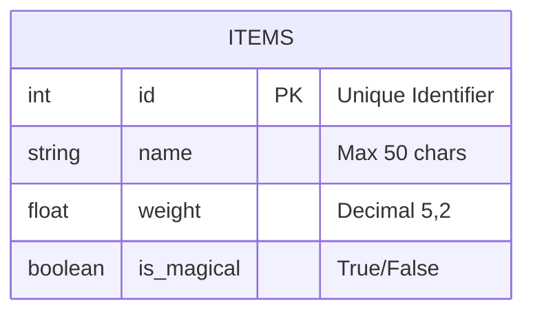
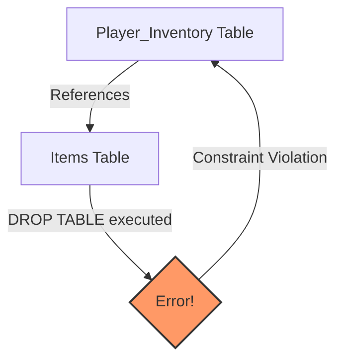

If SQL was a language for construction, the **Data Manipulation Language (DML)** (which we will cover later), would be the act of moving furniture, painting walls, and inviting guests over for dinner. But before you can hang a painting, you need a wall. Before you can host a dinner party, you need a dining room.

This is the domain of the **Data Definition Language (DDL)**.

DDL is the architect's blueprint. It is the heavy machinery that pours the foundation and frames the house. In the world of databases, "structure" isn't something that just happens; it must be explicitly defined. We have to tell the database engine exactly what our data looks like, how much space it needs, and how different pieces of data relate to one another.

In this chapter, we are going to build the storage structures for a hypothetical fantasy RPG text adventure. We need a place to store our heroes, their loot, and the monsters they fight. 

## 3.1 Create Table
The fundamental unit of storage in a relational database is the **table**. A table is a grid, yes, but it is a strictly typed grid. Unlike a spreadsheet where you can scribble a date in one cell and a formula in the next, a SQL table demands rigidity. 

To bring a table into existence, we use the `CREATE TABLE` statement. We need to give the table a name, and then define the columns that make up the table's "shape."

Let's create a table to hold the items in our players' inventory.

```sql
CREATE TABLE items (
    id INT PRIMARY KEY,
    name VARCHAR(50),
    weight DECIMAL(5, 2),
    is_magical BOOLEAN
);
```

While that looks simple, there is a lot of engineering happening behind those keywords.

1. `items`: The identifier for the table.
2. `id INT`: We define a column named `id` that holds integers.
3. `PRIMARY KEY`: This is a constraint. It tells the database that the `id` column must be unique for every single row, and it cannot be null. It is the identity of the row.
4. `VARCHAR(50)`: A "Variable Character" string. We are allocating enough space for 50 characters. If we store "Sword", it only takes up the space for "Sword." If we try to store a string with 51 characters, the database will shout at us.
5. `DECIMAL(5, 2)`: This represents a fixed-point *number*. The `5` is the precision (total distinct digits), and `2` is the scale (digits after the decimal). Perfect for weights like `125.50`.

!!! note "Design Note: The Cost of Types"

    You might be tempted to make every text field a `VARCHAR(MAX)` or every number a huge `BIGINT` just to be safe. Resist that urge. The database engine uses these type definitions to optimize how it stores data on the physical disk and in memory (RAM).

    If you tell the database a column is an integer, it knows it needs exactly 4 bytes per row. If you tell it the column is a massive string, it has to employ complex pointer logic to handle variable lengths. Strict types make for fast scans.

Here is a visualization of the schema we just defined:



## 3.2 Alter Table
Software development is rarely a straight line. Requirements change. You build the `items` table, and three weeks later, the game designers decide that items need to have a "durability" rating because players are having too much fun and their weapons need to break occasionally.

We cannot simply delete the table and start over (well, we *could*, but we'd lose all the data currently in it). Instead, we modify the existing structure in place using `ALTER TABLE`.

### Adding a Column
To add the durability stat:

```sql
ALTER TABLE items
ADD durability INT;
```

This instructs the database to go into the existing file structure and append a slot for an integer to every record.

### Modifying a Column
Perhaps we realized `VARCHAR(50)` is too short for an item named *"The Ancient Hammer of Everlasting Smashing and Crushing"*. We need to widen the column.

```sql
ALTER TABLE items
MODIFY name VARCHAR(100);
```

!!! warning "The Data Migration Trap"

    Altering a table is generally safe *if* you are widening a column or adding a new one. However, if you try to turn a `VARCHAR` into an `INT`, or shorten a `VARCHAR(100)` to `VARCHAR(10)`, you risk **data loss**.

    If the database cannot figure out how to squeeze the existing data into the new shape, the operation will fail. If it succeeds, it might truncate your data, always back up before you alter.


## 3.3 Truncate Table
Sometimes, you need a clean slate. Perhaps you are running automated tests. You fill the `items` table with dummy data, run your tests, and now you want to clear it out to run them again.

You *could* use a `DELETE` command (which we will cover in DML), but `DELETE` is polite. It visits every row, logs the deletion, checks constraints, and gently removes the data one item at a time. This is slow.

`TRUNCATE TABLE` is the nuclear option.

```sql
TRUNCATE TABLE items;
```

When you execute this, the database does not scan the table removing rows. Instead, it effectively deallocates the data pages that hold the table's content. It marks the storage as "empty" and resets any auto-incrementing counters back to zero.

It is brutally efficient.

| Feature | `DELETE` (DML) | `TRUNCATE` (DDL) |
|--|--|--|
| Speed | Slow (Row-by-row) | Fast (page deallocation) |
| Undo? | Can often be rolled back | Harder (sometimes impossible) to roll back |
| Resets IDs? | No | Yes |
| Triggers? | Fires "On Delete" triggers | Does not fire triggers |

!!! abstract "The High Water Mark"

    Imagine a notebook.

    **DELETE** is like taking an eraser and rubbing out every line of text, one by one. The pages are still crinkled, and you are still on page 50.

    **TRUNCATE** is like ripping all the used pages out of the notebook and setting your pen back on page 1, line 1. The notebook is effectively new.

## 3.4 Drop Table
Finally, we have the destructor. The project is cancelled. The feature is deprecated. We no longer need the `items` table at all.

To remove the structure entirely (not just the data inside it, but the blueprint itself) we use `DROP TABLE`.

```sql
DROP TABLE items;
```

This is immediate. The table definition is removed from teh database dictionary, and the data is unlinked.

### The Dependency Problem
The dangerous part of `DROP` isn't usually deleting the table you intend to; it's the collateral damage. In a relational database, tables are often linked. A `Players` table might link to an `Inventory` table.

If you try to drop the `items` table, but another table has a Foreign Key pointing to it, the database will stop you to prevent creating "orphan" records. 



To force the deletion (and destroy the links), some dialects allow a cascade, though it is a loaded gun:
```sql
-- This will delete the table AND any foreign key constraints pointing to it.
-- Use with extreme caution.
DROP TABLE items CASCADE;
```

## Quiz

<quiz>
In the context of the "construction" analogy used in the chapter, if Data Manipulation Language (DML) is like moving furniture, what is Data Definition Language (DDL)?
- [x] Pouring the foundation and framing the house.
- [ ] Painting the walls.
- [ ] Inviting guests over for dinner.
- [ ] Living in the house.

</quiz>

<quiz>
Which of the following SQL statements would correctly create the 'items' table described in the chapter?
- [x] `CRATE TABLE items (id INT PRIMARY KEY, name VARCHAR(50), weight DECIMAL(5, 2), is_magical BOOLEAN);`
- [ ] `MAKE TABLE items (id INT PRIMARY KEY, name TEXT);`
- [ ] `NEW TABLE items (id IDENTIFIER, name STRING);`
- [ ] `CREATE TABLE items (id INT, name VARCHAR(50));`

</quiz>

<quiz>
Why is it recommended to use strict data types (like `INT` or `DECIMAL`) instead of making every column a large string (`vARCHAR`)?
- [ ] Strings cannot hold numbers.
- [ ] It is required by the SQl standard to never use `VARCHAR`.
- [ ] It makes the SQL code look more professional.
- [x] The database engine optimizes storage and performance based on known type sizes.

</quiz>

<quiz>
Altering a table to shorten a `VARCHAR` column (e.g., from 100 characters to 10) is always a safe operation.
- [ ] True
- [x] False

</quiz>

<quiz>
You need to clear all data from the 'items' table to reset for a new test run. You want the IDs to reset to zero and you want it done instantly. Which command should you use?
- [ ] `DROP TABLE items;`
- [x] `TRUNCATE TABLE items;
- [ ] `DELETE FROM items;`
- [ ] `REMOVE ALL ITEMS;`

</quiz>

<quiz>
Which of the following is a characteristic of `TRUNCATE TABLE` compared to `DELETE`?
- [x] It deallocates data pages and cannot easily be rolled back in some contexts.
- [ ] It fires "On Delete" triggers for every row removed.
- [ ] It is slower because it checks constraints on every row.
- [ ] It preserves the current auto-incrementing ID counter value.

</quiz>

<quiz>
What happens if you try to `DROP` a table that is currently referenced by a Foreign Key in another table?
- [x] The database will likely prevent the operation to avoid 'orphan' records.
- [ ] The database assumes you know what you are doing and deletes both tables.
- [ ] The foreign key link is automatically removed, but the data stays.
- [ ] THe table is dropped, but the data is archived. 

</quiz>

<quiz>
To add a new column `durability` to the `items` table, which syntax is correct?
- [ ] `APPEND COLUMN durability INT TO items;`
- [ ] `UPDATE items SET durability INT;`
- [x] `ALTER TABLE items ADD durability INT;`
- [ ] `INSERT INTO items (durability) VALUES (int);`

</quiz>

<quiz>
What does the `DECIMAL(5, 2)` type definition imply about the number `125.50`?
- [ ] It has 5 digits before the decimal and 2 digits after.
- [ ] It can hold values up to 55555.22.
- [x] It allows for 5 digits of precision, with 2 of them being after the decimal point.
- [ ] It takes up 5 bytes of storage.

</quiz>

<quiz>
`DROP TABLE` removes the table definition but preserves the data in the database memory.
- [ ] True
- [x] False

</quiz>

<!-- mkdocs-quiz results -->

## Summary
We have spent this chapter acting as architects and engineers. We haven't played the game yet; we've merely built the game engine. We defined "what" and the "where", but not the "who". In the next chapter we stop being architects and start being inhabitants. We will learn how to populate these empty structures, change the data as the game state evolves, and surgically remove specific entities when they are destroyed. 

## Labs
Please complete Chapter 3 labs from the companion [GitHub Repository](https://github.com/mckenzie-andrew/odea-labs){target="_blank"}. 