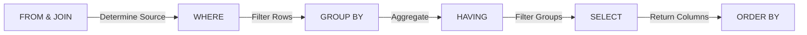

If Data Definition Language (DDL) is the architect blueprinting the house (deciding where the walls go and how much load the foundation can bear), then **Data Manipulation Language (DML)** is the act of actually living in it. It's moving the furniture in, painting the walls, rearranging the kitchen, and occasionally throwing out that old sofa.

In the world of SQL, DML is the daily grind. It is the language of verbs. It is how we interact with the state of our universe. 

## 4.1 Core Statements
Before we get to the flashy analytics, we need to handle the lifecycle of a row. Data is born, it changes, and eventually it dies (or at least, gets archived).

### INSERT
The genesis of a record. To bring new data into existence, we use the `INSERT` statement.

The database engine needs to know two things: *where* are we putting it, and *what* are we putting there?

```sql
INSERT INTO wizards (name, level, alignment)
VALUES ('Gandalf', 20, 'Neutral Good');
```

!!! note "Design Note: Explicit Columns"

    Technically, you don't *have* to list the column names `(name, level, alignment)` if you provide a value for every single column in the exact order they were defined in the table.

    **Don't do this.**

    Relying on implicit column ordering is fragile. If someone adds a column to the table definition next week, your `INSERT` statement will crash. Be explicit. It's polite to the future version of you who has to debug this.

You can also batch these operations. If you're initializing a guild, don't send a separate network request for every member.

```sql
INSERT INTO wizards (name, level, alignment)
VALUES
    ('Saruman', 20, 'Lawful Evil'),
    ('Radagast', 14, 'Chaotic Good');
```

### UPDATE
Data is rarely static. Wizards level up; alignments shift. The `UPDATE` statement allows us to modify existing records.

The syntax requires a target table, the changes (`SET`), and a condition (`WHERE`).

```sql
UPDATE wizards
SET level = 21, alignment = 'White'
WHERE name = 'Gandalf';
```

!!! warning "The Apocalypse Clause"

    The `WHERE` clause in an `UPDATE` statement is technically optional.

    If you run `UPDATE wizards SET level = 1`, the database will dutifully look at every single row in your table and set everyone back to level 1. There is no "Undo" button in a production database.

    **Always write your `WHERE` clause first.**

### DELETE
Sometimes, a record must be removed entirely.

```sql
DELETE FROM wizards
WHERE name = 'Saruman';
```

Just like `UPDATE`, omitting the `WHERE` clause is a scorched-earth policy. It will empty the table while leaving the table structure intact.

!!! abstract "Soft Deletes"

    In many production systems, we rarely actually `DELETE` rows. Hard deletion destroys history. If a user deletes their account, we usually want to keep the data for a grace period or for analytics.

    Instead, we implement "Soft Deletes." We add a column called `deleted_at` (a timestamp) ir `is_active` (a boolean). To "delete" a row, we simply `UPDATE` it:

    ```sql
    UPDATE wizards SET deleted_at = NOW()
    WHERE name = 'Sarauman';
    ```

    Then, we just ensure all our `SELECT` statements filter out rows where `deleted_at` is not null.

## 4.2 The SELECT Statement
If `INSERT`, `UPDATE`, and `DELETE` are the manual labor of SQL, `SELECT` is the art. This is where you will spend 90% of your time. It is how we ask questions and gain insights.

While we write SQL from top to bottom, the database engine executes it in a different order. Understanding this *"Logical Order of Execution"* is the key to understanding why SQL behaves the way it does.



### FROM
We start here. Before we can pick columns, we must pick the universe of data we are querying.

```sql
SELECT * FROM spells;
```

### WHERE
The `WHERE` clause acts as a bouncer. It stands at the door and checks the credentials of every single row trying to get into your result set. If the row returns `true` for the condition, it passes. If `false` or `NULL`, it is discarded.

```sql
SELECT name, mana_cost
FROM spells
WHERE mana_cost < 50 AND element = 'Fire';
```

### JOINS
Data is often normalized, that is split into separate tables to reduce redundancy. `JOINS` are how we stitch that reality back together.

Imagine we have a `wizards` table and a `guilds` table. A wizard belongs to a guild. To see a wizard's name alongside their guild's name, we need to join them.

```sql
SELECT wizards.name, guilds.name
FROM wizards
INNER JOIN guilds ON wizards.guild_id = guilds.id;
```

### Visualizing the Join
A `JOIN` is essentially a Cartesian product (every row matching every row) that is then filtered by the `ON` condition. We will briefly cover the different types here, but rest assured they have their own chapter where we will discuss them in depth.

- **INNER JOIN**: Only returns rows when there is a match in *both* tables. Loners without guilds don't show up.
- **LEFT JOIN**: Returns **all** rows from the **left** table (wizards), even if they have no matching guild.
- **RIGHT JOIN**: Returns **all** guilds, even if they have no members.

### GROUP BY
This is where we switch from looking at individual rows to looking at buckets of rows. `GROUP BY` squashes rows together based on a shared value.

If we want to know how many spells belong to each element, we group them.

```sql
SELECT element, COUNT(*)
FROM spells
GROUP BY element;
```

Think of this like sorting coins.  You dump the jar on the table (`FROM`), toss out the buttons and lint (`WHERE`), and then stacck the pennies, nickels, and dimes into separate piles (`GROUP BY`).

### HAVING
This is a common stumbling block. Why do we need `HAVING` if we already have `WHERE`?

Look back at the **Logical Order of Execution** diagram. `WHERE` happens *before* grouping. `HAVING` happens *after*.

If you want to filter based on an *aggregate* (like a count or an average), you must use `HAVING`.

```sql
SELECT element, AVG(damage)
FROM spells
GROUP BY element
HAVING AVG(damage) > 50;
```

*Translation:* Group the spells by element. Calculate the average damage for each group. *Then*, only show me the groups where the average is high.

### ORDER BY
Finally, the presentation layer. The database does not guarantee any specific order of rows unless you ask for it. If you want your wizards ranked by power, you must be explicit.

```sql
SELECT name, level
FROM wizards
ORDER BY level DESC, name ASC;
```

THis is the last thing that happens. The database has fetched, filtered, grouped, and calculated. Now, it simply arranges the final report cards before handing them to you.

## Quiz

<quiz>
In an `INSERT` statement, why is it considered a best practice to explicitly list the column names before the `VALUES` clause?
- [ ] It is a mandatory requirement of SQL; the query will fail without them.
- [ ] It allows you to bypass data type checks for the values being inserted.
- [x] It ensures the statement remains valid even if the table structure changes, such as columns being reordered or added.
- [ ] It significantly improves the performance speed of the insertion.

</quiz>

<quiz>
What is the result of executing an `UPDATE` statement that lacks a `WHERE` clause?
- [ ] The statement will fail and return a syntax error.
- [ ] Only the first row in the table will be updated.
- [x] Every single row in the target table will be updated with the new values.
- [ ] The database will prompt the user for confirmation before proceeding.

</quiz>

<quiz>
Which of the following best describes the concept of a "Soft Delete"?
- [ ] Removing the data from the main table and moving it to a backup tape.
- [ ] Deleting a row only if it has no related data in other tables.
- [x] Using an `UPDATE` statement to set a flag (like `is_active` or `deleted_at`) instead of physically removing the row.
- [ ] Using the `DELETE` statement but rolling back the transaction immediately.

</quiz>

<quiz>
According to the "Logical Order of Execution", which of the following clauses is processed *first* by the database engine?
- [ ] `ORDER BY`
- [ ] `WHERE`
- [ ] `SELECT`
- [x] `FROM`

</quiz>

<quiz>
Why is the `HAVING` clause necessary when `WHERE` already exists?
- [ ] `HAVING` executes faster than `WHERE` because it skips the index check.
- [ ] `HAVING` is a deprecated keyword that effectively does the same thing as `WHERE`.
- [x] `HAVING` is used to filter results based on aggregate calculations (like `COUNT` or `AVG`) which happen after grouping.
- [ ] `HAVING` is used to filter columns, whereas `WHERE` is used to filter rows.

</quiz>

<quiz>
You perform a `LEFT JOIN` between the `Wizards` table (left) and the `Guilds` table (right). Which of the following describes the result set?
- [ ] Only rows where a Wizard is actively a member of a Guild.
- [ ] All rows from the `Guilds` table, even if no Wizards belong to them.
- [ ] All rows from both tables, regardless of whether there is a match.
- [x] All rows from the `Wizards` table, even if they have no matching `Guild`.

</quiz>

<quiz>
What is the primary function of the `GROUP BY` clause?
- [ ] To limit the number of rows returned to a specific count.
- [x] To squash multiple rows sharing a specific value into a single bucket or summary row.
- [ ] To join two tables based on a common column.
- [ ] To sort the final result set in ascending or descending order.

</quiz>

<quiz>
The database guarantees that rows will be returned in a specific order (e.g., by insertion date) even if you do not use an `ORDER BY` clause.
- [ ] True
- [x] False

</quiz>

<quiz>
Which SQL clause corresponds to the "Presentation Layer" of the query, executed last to arrange the final report?
- [x] `ORDER BY`
- [ ] `SELECT`
- [ ] `GROUP BY`
- [ ] `FROM`

</quiz>

<!-- mkdocs-quiz results -->

## Summary
And there you have it. If DDL was the act of framing the walls and hanging the drywall, DML is the act of actually living in the house. We've covered the brute force of `INSERT`, `UPDATE`, and `DELETE`, the essential tools required to mutate the state of your world. But more importantly, we've dissected `SELECT`, the primary lens through which you will view that world. By understanding not just the syntax, but the *logical* order in which the database thinks, filtering before grouping, grouping before aggregating. You are no longer just shouting comman ds into the void; you are having a conversation.

## Labs
Please complete Chapter 4 labs from the companion [GitHub Repository](https://github.com/mckenzie-andrew/odea-labs){target="_blank"}. 